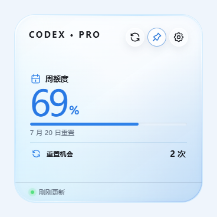

<p align="center">
  
</p>

<h1 align="center">QuotaGlance</h1>

<p align="center"><strong>把 Codex 额度留在桌面上。</strong></p>

<p align="center">
  轻量、本地、只读的 Codex 桌面额度工具。<br>
  用可展开额度卡片和动态水面悬浮球，随时查看周额度、重置时间与连接状态。
</p>

<p align="center">
  <a href="https://github.com/qingyu6688/QuotaGlance/releases/latest"></a>
  <a href="https://github.com/qingyu6688/QuotaGlance/releases"></a>
  
  <a href="LICENSE"></a>
</p>

<p align="center">
  <a href="https://github.com/qingyu6688/QuotaGlance/releases/latest"><strong>下载最新版</strong></a>
  ·
  <a href="https://github.com/qingyu6688/QuotaGlance/issues">反馈问题</a>
  ·
  <a href="#从源码构建">从源码构建</a>
</p>

<p align="center">
  
  
</p>

<p align="center"><sub>v0.1.7 真实桌面窗口：完整圆角周额度卡片与透明玻璃水球。额度和日期会根据当前账号实时变化。</sub></p>

## v0.1.7 更新

- 卡片和悬浮球聚焦周额度，暂时隐藏五小时/短周期额度，避免已停用口径继续占用界面空间。
- 修正透明窗口的裁切与背景叠层，卡片保持完整圆角矩形，不再出现隐约的方形底框。
- 按玻璃水球方向重新设计悬浮球，强化球壳高光、水线、液体层次、气泡和轻微晃动效果。
- 精简仅用于内部过程记录的 Markdown 文档，公开仓库保留使用、协作、安全和版本维护所需内容。

## 下载 QuotaGlance

当前版本：**`v0.1.7`**

选择与你的设备匹配的软件。Windows 普通用户推荐 EXE 安装版；Ubuntu、Debian 用户推荐 DEB；其他 Linux 发行版可优先尝试 AppImage。

| 系统 | 适用设备 | 软件安装包 |
|---|---|---|
| Windows | x64 | [EXE 安装版（推荐）](https://github.com/qingyu6688/QuotaGlance/releases/download/v0.1.7/QuotaGlance_0.1.7_windows_x64-setup.exe) · [MSI 安装包](https://github.com/qingyu6688/QuotaGlance/releases/download/v0.1.7/QuotaGlance_0.1.7_windows_x64.msi) |
| macOS | Apple Silicon | [DMG 安装包](https://github.com/qingyu6688/QuotaGlance/releases/download/v0.1.7/QuotaGlance_0.1.7_darwin_aarch64.dmg) |
| macOS | Intel 处理器 | [DMG 安装包](https://github.com/qingyu6688/QuotaGlance/releases/download/v0.1.7/QuotaGlance_0.1.7_darwin_x64.dmg) |
| Linux | x64 | [AppImage](https://github.com/qingyu6688/QuotaGlance/releases/download/v0.1.7/QuotaGlance_0.1.7_linux_amd64.AppImage) · [DEB](https://github.com/qingyu6688/QuotaGlance/releases/download/v0.1.7/QuotaGlance_0.1.7_linux_amd64.deb) |
| Linux | ARM64 | [AppImage](https://github.com/qingyu6688/QuotaGlance/releases/download/v0.1.7/QuotaGlance_0.1.7_linux_aarch64.AppImage) · [DEB](https://github.com/qingyu6688/QuotaGlance/releases/download/v0.1.7/QuotaGlance_0.1.7_linux_arm64.deb) |

[查看全部版本](https://github.com/qingyu6688/QuotaGlance/releases) · [下载 SHA-256 校验文件](https://github.com/qingyu6688/QuotaGlance/releases/download/v0.1.7/SHA256SUMS.txt)

> [!NOTE]
> 当前安装包尚未完成商业代码签名与 macOS 公证，首次启动时可能触发系统安全提示。请只从本仓库 Releases 页面下载，并使用 `SHA256SUMS.txt` 核对文件完整性。

## 为什么使用 QuotaGlance

- **周额度一眼可见**：悬浮球与展开卡片统一聚焦周额度、重置时间和数据状态，暂不展示五小时/短周期额度。
- **动态水面悬浮球**：水位随额度变化，水面带有轻微晃动、回弹和主题光效。
- **自由放置**：按住悬浮球即可拖到桌面任意位置，卡片/浮球显示模式会保存在本机。
- **快捷但不打扰**：双击展开或收起额度卡片；右键菜单只保留“设置”和“退出”。
- **七套外观主题**：支持跟随系统、极光、石墨、纸白，以及日落珊瑚、蜂蜜琥珀、玫瑰铜夜三套暖色主题。
- **稳定常驻**：30 秒内存缓存、5 分钟可见态安全重同步、通知触发完整重读，并在数据源暂时失败时执行退避且保留最后成功结果。
- **登录时启动**：可在设置中开启或关闭，系统状态与本地偏好会同步更新。
- **沿用本机登录状态**：无需再次输入账号、Token 或 API Key，也不会打开额外的本地服务端口。

## 开始使用

1. 在本机安装并登录包含 Codex 的 ChatGPT 桌面应用、旧版 Codex 桌面应用或 Codex CLI。
2. 下载并安装适合当前系统的 QuotaGlance。
3. 启动应用，等待它连接本机 Codex，周额度会自动显示。
4. 把悬浮球拖到合适位置，需要详情时双击展开卡片。

| 操作 | 功能 |
|---|---|
| 按住悬浮球左键拖动 | 移动悬浮球 |
| 双击悬浮球 | 展开或收起额度卡片 |
| 右键悬浮球 | 打开“设置 / 退出”菜单 |
| 点击刷新按钮 | 立即重新读取额度 |
| 点击图钉按钮 | 切换窗口置顶状态 |
| 打开设置 | 切换主题、卡片/浮球模式、鼠标穿透和登录时启动 |

## 常见问题

### 为什么没有显示额度？

先确认 ChatGPT 桌面应用中的 Codex 或 Codex CLI 已安装并完成登录。如果安装了 Codex CLI，可在终端执行：

```bash
codex --version
```

Windows 会优先发现已登录 Codex 桌面应用的受管运行时，因此不要求 `codex` 一定出现在 `PATH` 中。macOS 会优先检查系统与用户“应用程序”目录中的统一版 `ChatGPT.app`，再兼容旧版 `Codex.app`，最后回退到 `PATH` 和常见 CLI 目录；Linux 会检查 `PATH` 和常见用户安装目录。若仍无法发现，请先修复应用或 CLI 安装，再重新启动 QuotaGlance。这些候选均属于用户本机的外部安装，`0.1.7` 尚未验证其 OpenAI 代码签名，不能视为 QuotaGlance 随包提供的可信 sidecar。

### QuotaGlance 会读取我的 Token 吗？

不会。QuotaGlance 不读取 `auth.json`，不访问系统凭据库，也不保存 Token、API Key 或账号密码；它不会直接调用非公开 `wham` HTTP 接口。额度认证与服务请求始终由本机 Codex App Server 处理。

### 为什么系统提示安装包来源未知？

当前 `0.x` 版本尚未完成 Windows 商业代码签名和 macOS 公证。请确认文件来自本仓库 Releases，并使用同一页面提供的 SHA-256 清单校验后再安装。

## 安全与隐私

QuotaGlance 的额度读取过程全部在本机完成：

- 不读取 Codex 的 `auth.json`；
- 不调用非公开 `wham` HTTP 接口，不自行拼装认证请求；
- 不保存 Token、API Key 或账号密码；
- 不上传额度历史、提示词、项目内容和账号信息；
- 不执行登录、登出、购买额度等账号写操作；
- 默认不启用遥测，不建立云端账号；
- 刷新失败时保留最后一次成功结果，不会把未知状态误显示成 `0%`。

如需报告安全问题，请按照 [安全策略](SECURITY.md) 私下联系维护者，不要创建公开 Issue。

## 参与贡献

QuotaGlance 是一个开放协作的 MIT 开源项目，欢迎提交 Issue、界面改进和 Pull Request。

目前尤其需要：

- Windows、macOS 和主流 Linux 发行版实机测试；
- 不同 Codex CLI / App Server 版本的兼容性反馈；
- Windows 代码签名、macOS 公证与发布流程支持；
- 无障碍、国际化和主题细节改进。

开始贡献前，请阅读 [贡献指南](CONTRIBUTING.md) 和 [行为准则](CODE_OF_CONDUCT.md)。

## 从源码构建

<details>
<summary><strong>展开开发与构建命令</strong></summary>

### 环境要求

- Node.js `>= 20.19.0`
- npm
- Rust stable 与 Cargo
- 当前平台对应的 [Tauri 2 开发前置条件](https://v2.tauri.app/start/prerequisites/)

### 浏览器界面预览

```bash
npm ci
npm run dev
```

浏览器预览使用模拟额度数据。连接真实本机 Codex 需要运行桌面版本：

```bash
npm run tauri dev
```

### 质量检查

```bash
npm run check
cargo fmt --manifest-path src-tauri/Cargo.toml --all -- --check
cargo clippy --manifest-path src-tauri/Cargo.toml --all-targets --all-features -- -D warnings
cargo test --manifest-path src-tauri/Cargo.toml --all-targets --all-features
```

### 构建安装包

```bash
npm run tauri build
```

[](https://github.com/qingyu6688/QuotaGlance/actions/workflows/ci.yml)
[](https://github.com/qingyu6688/QuotaGlance/actions/workflows/release.yml)

技术栈：Tauri 2、React、TypeScript、Vite、Rust、Vitest。

</details>

## 许可与声明

项目采用 [MIT License](LICENSE) 开源。

QuotaGlance 是独立第三方工具，与 OpenAI 不存在隶属、授权或背书关系。任何 Codex 相关商标与产品名称归其各自权利人所有。

项目在常驻窗口、额度字段与刷新体验上参考了 [change-42-yhmm/quota-float](https://github.com/change-42-yhmm/quota-float)，界面与实现独立完成。QuotaGlance 保留自己的安全边界：只使用 Codex App Server，不读取凭据文件，也不调用参考项目所依赖的非公开额度接口。

维护邮箱：maorongkang@gmail.com
