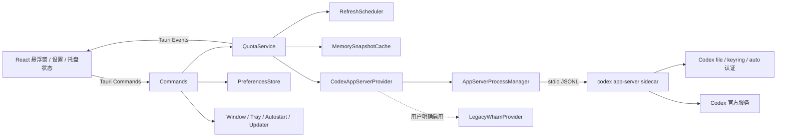

# QuotaGlance 项目分析与立项建议

> 文档版本：1.0  
> 编写日期：2026-07-12  
> 维护邮箱：maorongkang@gmail.com

## 1. 结论先行

### 1.1 推荐项目名

**QuotaGlance（额度一览）**

- 完整标题：**QuotaGlance — 本地优先的 Codex 额度悬浮助手**
- 中文名：**额度一览**
- 中文口号：**额度一眼可见，编码不再撞线。**
- 英文口号：**See your quota. Keep your flow.**
- GitHub 仓库名：`quota-glance`
- 可执行文件名：`quota-glance`
- Tauri Bundle ID：`io.github.<account>.quotaglance`，有自有域名时改为 `com.<domain>.quotaglance`
- 首个正式版本：`1.0.0`，内部开发版本从 `0.1.0` 开始

采用这个名字的原因：

1. `Glance` 准确表达“看一眼就知道”，与悬浮球、托盘和菜单栏的使用方式一致。
2. 主品牌不直接使用 `OpenAI` 或 `Codex`，可以降低被误认为官方产品的风险。
3. 名称不限制未来接入其他 AI 编码服务，但首版仍应只做 Codex，避免过早扩张。
4. 截至 2026-07-12 的网页与 GitHub 初筛，没有发现明显的同类软件占用；这只是名称初筛，不等同于商标法律意见，发布前仍需检查 CNIPA、WIPO、USPTO、EUIPO、应用商店、域名和软件包注册表。

备选名称：

| 顺序 | 英文名 | 中文名 | 更适合的方向 |
|---|---|---|---|
| 2 | QuotaBeacon | 额度灯塔 | 强调预警、可靠性和多服务扩展 |
| 3 | QuotaGlow | 余光 | 强调轻量视觉、柔和浮球和消费级体验 |

不建议使用 `QuotaPulse`、`QuotaHalo`、`QuotaDock`、`QuotaTray` 等名称，当前已经存在同类或高度相近项目。

### 1.2 立项结论

项目**技术上可行，产品价值明确，核心风险是 Codex App Server 的随包分发、版本兼容和双平台凭据存储验证**。

推荐使用 **Tauri 2 + Rust + React + TypeScript + Vite**，做成 Windows 与 macOS 共用一套业务代码的本地桌面工具。首版不建设服务器、不使用 MySQL、不启动本地 REST 服务，React 与 Rust 通过 Tauri IPC 通信。

参考项目 [Quota Float](https://github.com/change-42-yhmm/quota-float) 的 UI、Tauri 分层和安全兜底值得参考，但其数据获取路线不应作为 QuotaGlance 的正式主方案。Quota Float 由 Rust 直接读取本机登录文件并访问非公开后端；QuotaGlance 应优先使用官方 Codex App Server，让官方进程负责认证和额度协议，React 只接收规范化快照。

Quota Float 不适合原样复制为正式产品，原因包括：

- 额度查询依赖 ChatGPT 的非公开后端接口，没有使用已公开的 App Server 额度方法。
- “实时”实际是 1～5 分钟轮询，没有订阅 App Server 的额度更新通知。
- 当前公开构建未签名、未公证。
- 大量 Windows/macOS 实机行为仍未完成验证。
- 鼠标穿透锁定入口没有完整接通，部分多 Provider 设计只是预留代码。
- 没有正式自动更新机制。

OpenAI 官方资料确认 Codex 存在五小时共享使用窗口，并可能有额外周限制；用户可通过 Codex Usage 页面查看当前限额，也可在 CLI 中使用 `/status`。官方没有提供供第三方直接调用的个人额度 HTTP API，但 Codex App Server 已公开稳定的本地协议：`account/read` 可读认证方式和套餐，`account/rateLimits/read` 可读一个或多个额度桶，`account/rateLimits/updated` 会推送额度变化。QuotaGlance 应把它作为首选数据源。[Codex App Server](https://developers.openai.com/codex/app-server)｜[OpenAI Codex 定价与使用限制](https://developers.openai.com/codex/pricing)

推荐的数据源顺序：

1. **正式主路线**：随应用携带经固定版本和签名验证的 Codex App Server sidecar，通过本地 `stdio` JSONL 通信。
2. **开发期路线**：发现用户单独安装的 Codex CLI，并启动 `codex app-server` 做可行性验证。
3. **兼容降级**：私有 `wham` 端点默认关闭，仅在政策允许、用户明确启用且官方路线暂时不可用时使用。
4. **最终降级**：打开官方 Codex Usage 页面，不显示猜测值。

## 2. 项目概览

| 项目 | 规划内容 |
|---|---|
| 项目名称 | QuotaGlance |
| 中文名称 | 额度一览 |
| 项目类型 | macOS / Windows 跨平台桌面工具 |
| 首个正式版本 | 1.0.0 |
| 核心技术栈 | Tauri 2、Rust、React、TypeScript、Vite |
| 主要入口 | `src/`、`src-tauri/src/` |
| 本地存储 | JSON 偏好配置；首版不保存额度历史 |
| 数据库 | MVP 不需要数据库；以后增加本地历史时优先 SQLite |
| 内部通信 | Tauri Commands + Events，不开放本地端口 |
| 额度数据源 | Codex App Server `account/rateLimits/read` + 更新通知 |
| 进程通信 | Rust 与 App Server 通过本地 `stdio` JSONL；不监听网络端口 |
| 外部通信 | 由官方 App Server 访问 Codex 服务；兼容 Provider 默认关闭 |
| 发布方式 | Windows 签名 NSIS/MSI；macOS 签名、公证 Universal DMG，或等价的 Intel/Apple Silicon 双架构 DMG |
| 目标平台 | Windows 11 x64；Windows 10 22H2 仅对仍获 ESU 安全更新的设备尽力支持；macOS 13+ Intel / Apple Silicon |
| 开源建议 | 主项目 MIT；复用 Quota Float 保留 MIT；随包分发 Codex 时保留 Apache-2.0 LICENSE/NOTICE |

### 2.1 一句话定位

面向 Codex 高频用户的本地额度助手，通过桌面浮球、展开卡片和系统托盘，近实时展示当前可用额度桶、常见五小时窗口、可选周限制、重置时间和数据状态，让用户不离开当前编码工作流就能安排任务节奏。

### 2.2 产品原则

- **一眼可读**：最重要的数据在浮球上即可判断。
- **本地优先**：不建设中转服务器，不上传登录凭据和使用记录。
- **只读**：只查询，不兑换重置机会，不购买额度，不修改账号设置。
- **真实优先**：展示服务端返回的数据；未知就显示未知，不估算成伪造数字。
- **状态透明**：始终显示最后成功更新时间和数据新鲜度。
- **安静常驻**：默认低频刷新、低资源占用，不抢焦点、不干扰编辑器。
- **双端一致**：Windows 和 macOS 的功能口径一致，平台交互遵循各自习惯。

## 3. 用户与场景分析

### 3.1 核心用户

1. **高频独立开发者**：每天长时间使用 Codex，希望在开始大型任务前确认额度。
2. **自由职业者和多项目开发者**：需要根据重置时间安排交付顺序。
3. **团队中的一线开发者**：需要在 IDE、终端和 Codex 之间保持连续工作流。
4. **注重隐私的技术用户**：不愿把 Token、提示词或使用记录交给第三方服务。
5. **跨平台用户**：工作机和个人设备分别使用 Windows、macOS，希望行为一致。

首版不以团队管理员、成本中心负责人和组织级用量管理者为主要用户，否则项目会从本地工具扩张为需要账号、服务端、权限体系和合规能力的 SaaS。

### 3.2 典型场景

- 开始大型重构前，快速确认当前额度桶和重置时间是否适合继续工作。
- 深度工作中，用余光查看浮球，不切换应用。
- 接近上限时收到本地提醒，决定缩小任务或等待重置。
- 根据重置时间安排高消耗任务。
- 电脑睡眠、断网或切换网络后，自动恢复刷新。
- 登录失效时，明确提示“Codex 未登录或登录已过期”。
- 接口格式变化时，保留最后一次成功值并提示“当前版本暂不兼容”，不显示假数据。

## 4. 参考项目审查

### 4.1 当前基线

审查对象为 `change-42-yhmm/quota-float` 当前 `main` 分支，版本 `0.1.3`，本次审查的最新提交日期为 2026-07-09。仓库采用 MIT License。[仓库主页](https://github.com/change-42-yhmm/quota-float)｜[MIT License](https://github.com/change-42-yhmm/quota-float/blob/main/LICENSE)

技术栈：

- React 19、TypeScript、Vite、Vitest。
- Tauri 2、Rust、Tokio、Reqwest、Serde。
- 单实例、开机启动、窗口状态恢复和托盘功能。
- GitHub Actions 生成 Windows 与 macOS Universal 构建。

核心实现见 [package.json](https://github.com/change-42-yhmm/quota-float/blob/main/package.json)、[Cargo.toml](https://github.com/change-42-yhmm/quota-float/blob/main/src-tauri/Cargo.toml) 和 [项目总结](https://github.com/change-42-yhmm/quota-float/blob/main/docs/PROJECT-SUMMARY.md)。

### 4.2 参考项目的数据与认证方式

参考项目的 Rust 层会读取：

```text
${CODEX_HOME}/auth.json
或
~/.codex/auth.json
```

它从登录数据中读取 access token 和可选账号 ID，只在 Rust 进程中使用，然后请求：

```text
GET https://chatgpt.com/backend-api/wham/usage
GET https://chatgpt.com/backend-api/wham/rate-limit-reset-credits
```

两个端点都属于非公开兼容接口。参考项目也明确把这件事列为已知限制，字段或认证方式随时可能变化。[额度适配实现](https://github.com/change-42-yhmm/quota-float/blob/main/src-tauri/src/codex.rs)｜[已知限制](https://github.com/change-42-yhmm/quota-float/blob/main/docs/KNOWN-LIMITATIONS.md)

OpenAI 官方认证文档说明，本地 Codex 可以通过 ChatGPT 订阅登录，也可以使用 API Key；两种方式对应不同的用量与管理体系。凭据既可能保存在 `auth.json`，也可能保存在操作系统凭据库，具体由 `file | keyring | auto` 配置决定。因此，仅读取 `auth.json` 无法覆盖当前全部官方登录态。[OpenAI Codex 认证说明](https://developers.openai.com/codex/auth)

因此 QuotaGlance 1.0 必须明确支持范围：

- 主要支持通过 ChatGPT 订阅登录的 Codex 本地会话。
- API Key 模式属于按量计费和 API rate limits，不应与五小时订阅额度混为一谈。
- 如果检测到 API Key 模式但没有订阅额度窗口，应提示“当前登录方式使用 API 按量计费”，而不是显示查询失败。

### 4.3 正式数据源：Codex App Server

Codex App Server 是 OpenAI 为富客户端公开的本地集成协议，也是 Codex 自身客户端使用的接口。QuotaGlance 应在 Rust 中启动 App Server 子进程，使用默认 `stdio` 传输和逐行 JSON 消息，完成以下流程：[Codex App Server 官方文档](https://developers.openai.com/codex/app-server)

```text
启动 codex app-server
→ initialize { clientInfo: { name: "quota_glance", ... } }
→ initialized
→ account/read
→ account/rateLimits/read
→ 持续监听 account/updated
→ 持续监听 account/rateLimits/updated
```

首版不启用 `experimentalApi`，只使用公开稳定方法：

- `account/read`：读取 `apiKey`、`chatgpt` 等认证类型和可用套餐信息。
- `account/updated`：认证模式或套餐发生变化时更新 UI。
- `account/rateLimits/read`：读取额度桶、窗口、已用比例、重置时间、credits 和 reset credits。
- `account/rateLimits/updated`：额度变化通知。把它视为缓存失效信号，合并短时间内的重复通知后重新调用 `account/rateLimits/read`，不要假定通知总含完整多桶数据。

App Server 返回 `rateLimitsByLimitId` 时应优先使用多桶视图；`rateLimits` 只作为向后兼容的单桶视图。每个桶按 `limitId`、可选 `limitName`、`primary`、`secondary` 和可选 `planType` 解析。`windowDurationMins` 决定窗口时长，不能假定所有账号永远只有五小时和一周两种窗口。

App Server 也公开了消耗 reset credit 的写方法，但 QuotaGlance 的产品边界是只读，**不得调用或向 UI 暴露** `account/rateLimitResetCredit/consume`、登出或其他账号写操作。

#### Sidecar 分发建议

- 开发与 POC 阶段：允许用户指定或自动发现单独安装的 `codex` 可执行文件。
- 1.0 正式版：优先随应用携带固定版本的 Codex App Server sidecar，避免 PATH、macOS GUI 环境和 WindowsApps 权限差异。
- Sidecar 版本随 QuotaGlance 发布节奏更新，启动时校验版本，协议不兼容时给出明确提示。
- Codex 官方仓库采用 Apache-2.0 License；随包再分发前要完成许可审查，并在安装包和关于页保留对应 LICENSE/NOTICE。[OpenAI Codex 开源仓库](https://github.com/openai/codex)
- macOS 1.0 必须覆盖 Intel 与 Apple Silicon。Universal 应用加 Universal sidecar 是首选；若合并验证不稳定，两套分别签名、公证的架构 DMG 也可作为等价交付。

正常路径下 QuotaGlance 不读取 `auth.json`、不访问系统 keyring、不接触 access token；这些全部由 App Server 处理。只有明确启用的 `LegacyWhamProvider` 才需要参考项目中的直接凭据读取逻辑。

### 4.4 值得复用的设计

以下措施只适用于默认关闭的 `LegacyWhamProvider`：

- 只有 Rust 处理 Token，绝不传给 React。
- auth 文件大小限制为 256 KiB，响应体限制为 1 MiB。
- HTTP 请求禁止重定向，避免 Authorization 被带到其他域名。
- 请求超时、敏感 Header、不记录原始响应。
- 并行获取主额度与 reset credits，子接口失败不拖垮主额度。

以下通用设计可继续复用：

- 30 秒缓存与并发请求锁。
- 对 snake_case、camelCase、比例和百分比字段做兼容解析。
- 失败后保留最后成功快照并标记 `stale`。
- 单实例、托盘、关闭隐藏、开机启动、窗口位置恢复。
- 浏览器预览使用 mock，桌面端才读取真实登录态。
- 隐私和安全边界写入独立文档。[隐私说明](https://github.com/change-42-yhmm/quota-float/blob/main/PRIVACY.md)｜[安全说明](https://github.com/change-42-yhmm/quota-float/blob/main/SECURITY.md)

### 4.5 不应原样复制的部分

1. 不要把两个 `wham` 端点作为正式主路线；如果保留兼容能力，必须隔离在默认关闭的 `LegacyWhamProvider`。
2. 不要承诺“真正实时”；当前参考实现正常约 5 分钟刷新，临近重置约 1 分钟刷新。
3. 不要复用项目名、Bundle ID、截图、视觉稿和可能涉及第三方品牌的图标。
4. 不要原样复制当前鼠标穿透交互：Rust 已实现锁定，但前端可见入口没有完整接通。
5. 不要保留没有落地的 Claude、多 Provider 轮播等代码。
6. 不要向普通用户发布未签名、未公证安装包。
7. 不要把“检测到剩余百分比下降”描述成后端返回的实时消费状态；它只能作为本地推断，并应明确标注。
8. 不要把额度窗口硬编码成永远只有五小时和每周两个字段；App Server 已支持按 `limitId` 返回多额度桶，额度体系也包含额外周限制、credits 和 reset credits。[Codex App Server 多额度桶](https://developers.openai.com/codex/app-server)｜[OpenAI Codex 使用限制](https://developers.openai.com/codex/pricing)

### 4.6 本次本地验证结果

在 Windows 审查环境中对参考仓库执行：

```powershell
npm ci
npm test
npm run build
cargo test --manifest-path src-tauri\Cargo.toml
npm audit --audit-level=high --registry=https://registry.npmjs.org
```

结果：

- 前端：2 个测试文件、14 个测试全部通过。
- Rust：45 个测试全部通过，其中包含 9 个假 App Server 跨进程契约测试。
- TypeScript 与 Vite 生产构建通过。
- npm 官方审计结果为 0 个已知漏洞。
- 这些结果只证明当前单元测试和 Web 构建基线可用，不代表真实额度、托盘、透明窗、休眠恢复和签名安装包已经完成双平台验收。

## 5. 功能范围

### 5.1 P0：1.0.0 必须完成

| 模块 | 功能 | 验收重点 |
|---|---|---|
| App Server | 启动、握手、版本检查、异常重启 | 使用固定 sidecar 或明确的外部 CLI 路径 |
| 登录态 | 通过 `account/read` 检测认证模式和套餐 | 应用不读取 Token，兼容 file/keyring/auto |
| 额度 | 动态额度桶、窗口、重置时间；常见五小时/周窗口做友好映射 | 周窗口缺失不算失败，不伪造字段 |
| Credits | credits、reset credits 数量与到期时间 | 缺失时局部降级，保持只读 |
| 刷新 | 初次读取、更新通知、手动刷新、安全重同步 | 通知去重，避免并发重复请求 |
| 状态 | 加载、正常、旧数据、未登录、额度触顶、数据源繁忙、App Server 缺失/过旧、离线、服务故障、格式不兼容 | 文案可理解、状态不混淆 |
| 浮球 | 在 128px 球体内显示周额度、动态剩余比例、重置日期、状态和液体水位 | 不只依赖红绿颜色；低水位时辅助文字保持可读 |
| 卡片 | 展示完整额度和最后更新时间 | 信息层级清楚 |
| 托盘 | 显示/隐藏、刷新、置顶、锁定、开机启动、更新、退出 | 锁定后始终可从托盘解锁 |
| 窗口 | 拖动、折叠、置顶、鼠标穿透、记忆位置 | 多屏拔插后仍可找回窗口 |
| 平台 | Windows 11 x64、macOS 13+ Intel/Apple Silicon；Windows 10 ESU 尽力支持 | 功能一致、视觉允许小幅平台差异 |
| 语言 | 简体中文、英文 | 错误信息也必须本地化 |
| 主题 | 跟随系统、极光、石墨、纸白、日落珊瑚、蜂蜜琥珀、玫瑰铜夜 | 保持可读性；冷色主题带材质化边框光效，并让浮球水面、球壳、卡片与边框同步换色 |
| 安全 | 正常路径不接触 Token；固定 sidecar、最小 IPC、无敏感日志 | 静态审查与运行时验证 |
| 发布 | Windows 签名包、macOS 签名与公证包 | 普通用户可正常安装 |
| 更新 | 签名的应用内更新检查 | 不做静默强制更新 |

### 5.2 P1：1.1.x 建议增加

- Windows ARM64 构建与实机验证。
- 自定义低额度提醒阈值和安静时段。
- 托盘图标展示用户选择的两个额度桶或窗口。
- 匿名诊断包导出，默认脱敏且由用户主动触发。
- Stable / Beta 更新通道。
- 更完整的代理网络和企业网络诊断。

### 5.3 P2：后续评估

- 用户主动开启的 7 天、30 天本地历史。
- 基于 `account/usage/read` 的本地只读活动摘要，需与额度窗口明确区分。
- 本地消耗速率和预计耗尽时间，必须标注为“预测”。
- 多账号手动切换。
- Claude、Gemini 等多 Provider 适配器。
- 团队级汇总，但需要独立立项，不能直接塞进桌面 MVP。

### 5.4 首版明确不做

- 自建 Codex 登录页或中转登录。
- 上传、同步或备份 Codex Token。
- 自动兑换 reset credits、购买额度或修改账号。
- 根据本地 token 数量推算服务端额度。
- 云同步、团队后台、移动端。
- 自动替用户切换模型或执行账号操作。
- 额外接入 MySQL、Redis、消息队列或云服务器。

## 6. 额度口径与状态模型

### 6.1 统一口径

界面统一展示“剩余额度”。App Server 返回 `usedPercent` 时，由 Rust Provider 转换为 `remainingPercent`，同时保留原始口径用于诊断；前端不重复计算。

必须区分：

- `buckets`：按 `limitId` 区分的额度桶；一个桶可有 `primary`、`secondary` 等窗口。
- `windows`：有重置周期的额度窗口，五小时和周窗口只是常见映射，不是固定字段。
- `bankedResets`：可用重置次数和到期时间。
- `credits`：App Server 返回的中性 credit 数据；保留服务端类型、标签和适用范围，不自行归类为 flexible pricing。
- `apiUsage`：API Key 按量计费信息，不能和订阅额度混在同一进度条中。

### 6.2 推荐领域模型

```text
QuotaSnapshot
  source: appServer | legacyCompat
  provider
  authMode
  plan
  buckets[]
  bankedResets
  credits
  status
  fetchedAt
  lastGoodAt
  nextRetryAt
  schemaVersion

QuotaBucket
  limitId
  limitName
  planType
  windows[]
  rateLimitReachedType

QuotaWindow
  slot: primary | secondary | other
  kind: shortTerm | weekly | monthly | unknown
  label
  usedPercent
  remainingPercent
  resetsAt
  windowDurationMins

QuotaError
  code
  messageKey
  retryable
  retryAfter
```

错误对象禁止包含 access token、账号 ID、原始请求头、原始响应、auth 路径或个人文件路径。

### 6.3 状态定义

| 状态 | 含义 | 界面行为 |
|---|---|---|
| `loading` | 首次读取中 | 骨架状态，不显示假百分比 |
| `ok` | 数据正常 | 显示额度和更新时间 |
| `stale` | 刷新失败但有历史成功值 | 保留旧值，显示最后成功时间 |
| `signedOut` | 未登录或登录已过期 | 引导打开 Codex 登录 |
| `apiKeyMode` | 当前为 API Key 按量模式 | 说明不适用订阅窗口 |
| `offline` | 本机离线或代理不可达 | 自动低频重试 |
| `quotaReached` | `rateLimitReachedType` 表明额度窗口已触顶 | 显示服务端分类和重置时间 |
| `sourceBusy` | App Server 或上游返回可重试错误 | 指数退避；不假定存在 HTTP 状态或 Header |
| `serviceUnavailable` | 服务暂时不可用 | 保留旧值并退避 |
| `incompatible` | 响应格式变化 | 提示升级应用，不显示 0% |

## 7. 技术选型

### 7.1 推荐：Tauri 2 + Rust + React

这个项目窗口小、长期驻留，需要托盘、sidecar 子进程管理和严格 IPC，也要求把 Codex 认证与 WebView 隔离。Tauri 允许用 Rust 负责 App Server 生命周期、协议、缓存、调度和系统能力，用 React 负责 UI，适配度最高。

Tauri 在 Windows 使用 WebView2，在 macOS 使用系统 WebKit；官方插件覆盖单实例、开机启动、窗口状态和更新等能力。[Tauri WebView 说明](https://v2.tauri.app/reference/webview-versions/)｜[Tauri 插件支持表](https://v2.tauri.app/plugin/)

| 维度 | Tauri 2 + Rust | Electron | Windows/macOS 原生双端 |
|---|---|---|---|
| 代码复用 | 高 | 高 | 低 |
| 常驻资源 | 较低 | 较高 | 最优 |
| 安装体积 | 小 | 较大 | 小 |
| 前端效率 | 高 | 最高 | 较低 |
| 凭据隔离 | App Server 持有认证，应用 Core 不接触 Token | 依赖 main/preload/renderer 正确配置 | 最强 |
| 托盘与透明窗 | 能满足，需实机校准 | 生态成熟 | 最佳 |
| 双端维护成本 | 低 | 低 | 高 |
| 本项目建议 | **首选** | 团队完全不会 Rust 时的备选 | 暂不采用 |

### 7.2 为什么不使用 MySQL 和本地 REST

MVP 只有用户偏好和短期内存快照，没有多人协作、复杂查询或远程业务服务。引入 MySQL 会增加安装、权限、升级和故障面；启动本地 REST 端口还会增加鉴权、端口冲突和本地攻击面。

因此：

- React 与 Rust 直接使用 Tauri IPC。
- 偏好存储为小型 JSON 文件，采用临时文件、原子替换和备份恢复。
- 额度快照默认只放内存。
- 未来增加历史趋势时，使用应用内 SQLite，并由迁移文件管理结构。

## 8. 总体架构



### 8.1 目录建议

```text
quota-glance/
  src/
    api/                    # Tauri IPC 封装，不直接发远程请求
    assets/
    components/
    features/
      quota/
      settings/
    hooks/
    i18n/
    pages/
    types/
    utils/
  src-tauri/
    capabilities/
    src/
      commands/
      domain/
        models.rs
        errors.rs
      providers/
        mod.rs
        codex/
          app_server.rs
          process.rs
          protocol.rs
          parser.rs
          legacy_wham.rs       # 默认关闭的兼容降级
      services/
        quota_service.rs
        refresh_scheduler.rs
        snapshot_cache.rs
        preferences.rs
        updater.rs
      platform/
        window.rs
        tray.rs
        autostart.rs
      app.rs
      lib.rs
      main.rs
  tests/
    e2e/
    fixtures/
  docs/
  .github/workflows/
```

### 8.2 模块职责

- `CodexAppServerProvider`：调用 `account/read`、`account/rateLimits/read` 并订阅更新通知。
- `AppServerProcessManager`：定位或启动固定 sidecar，完成握手、版本检查、退出和重启退避。
- `AppServerProtocol`：处理请求 ID、响应、通知、超时和畸形 JSON，不承载 UI 逻辑。
- `LegacyWhamProvider`：默认关闭的兼容降级；唯一允许处理非公开端点和直接凭据读取的模块。
- `QuotaService`：把 Provider 数据转换为稳定领域模型。
- `RefreshScheduler`：在 Rust/Tokio 后台调度，不依赖 WebView 定时器。
- `MemorySnapshotCache`：缓存最后成功值、当前状态和下一次重试时间。
- `PreferencesStore`：保存窗口、语言、主题和提醒偏好。
- `WindowManager`：处理浮球、卡片、置顶、穿透、多显示器和 DPI。
- `TrayManager`：处理菜单、解锁兜底和真正退出。
- `UpdateManager`：只负责签名更新检查，与额度刷新完全分离。
- React：只消费规范化快照，不读取 auth 文件、不访问 keyring、不直接请求 ChatGPT。

### 8.3 IPC 建议

首版只开放细粒度命令：

```text
get_quota_snapshot
refresh_quota
get_app_server_status
get_preferences
save_preferences
set_widget_mode
set_always_on_top
set_click_through
check_for_updates
install_update
```

Rust 向前端发送：

```text
quota://snapshot-updated
quota://refresh-state-changed
quota://auth-state-changed
quota://app-server-state-changed
app://update-available
```

Tauri Capability 只给 `widget` 和 `settings` 窗口授权必要能力，不授予通用文件系统、Shell 或任意网络权限。[Tauri Capabilities](https://v2.tauri.app/security/capabilities/)

## 9. 更新、缓存与恢复

“近实时”优先依靠 App Server 通知，定时读取只用于启动、校准和故障恢复：

| 条件 | 策略 |
|---|---|
| 启动 | 启动 App Server、握手，然后执行 `account/read` 和 `account/rateLimits/read` |
| 额度变化 | 收到 `account/rateLimits/updated` 后使缓存失效，并合并触发一次 `account/rateLimits/read` |
| 认证变化 | 收到 `account/updated` 后重新读取账号和额度 |
| 正常可见 | 每 5 分钟执行一次安全重同步，防止漏通知 |
| 窗口隐藏、仅托盘驻留 | 每 10 分钟安全重同步 |
| 手动刷新 | 调用 `account/rateLimits/read`，设置 30 秒冷却 |
| 睡眠、网络恢复、窗口重新显示 | 重连 App Server；快照超过 60 秒时重新读取 |
| 内存缓存 | TTL 30 秒 |
| 并发调用 | SingleFlight，同类读取只保留一个在途请求 |
| App Server 退出 | 1 秒、2 秒、5 秒、15 秒、30 秒重启退避，连续失败后停止高频重启 |
| 读取失败 | 30 秒、1 分钟、2 分钟、5 分钟、15 分钟、30 分钟 |
| 抖动 | 在退避时间上加入约 10% 随机值 |
| 登录失效 | 停止高频重试，只保留低频检查与手动刷新 |
| LegacyWhamProvider | 用户明确启用后才轮询；正常 5 分钟，临近重置最低 1 分钟，429 遵守 `Retry-After` |

失败策略：

- 有历史成功数据：保留最后成功值并标记 `stale`。
- 没有历史数据：显示明确错误状态。
- App Server 缺失、版本过旧或 sidecar 无法执行：给出安装/升级/修复入口，不自动读取 Token。
- 多桶结果中某个可选字段缺失：其他桶继续正常显示。
- 响应结构变化：进入 `incompatible`，禁止回退为 0%。

## 10. UI 与交互设计

### 10.1 三种窗口状态

1. `orb`：80～100 像素浮球，显示最关键剩余比例和状态符号。
2. `card`：约 320×320 的展开卡片，显示完整额度、重置时间和更新时间。
3. `hidden`：隐藏窗口，只保留系统托盘或 macOS 菜单栏。

### 10.2 信息层级

展开卡片从上到下：

1. 产品名、套餐、刷新状态。
2. 用户选定的主额度桶及其最短窗口。
3. 其余额度桶或 `secondary` 窗口；存在周限制时显示为“周额度”。
4. 各窗口重置时间、credits 和 reset credits。
5. 最后成功更新时间、数据新鲜度。
6. 刷新、置顶、穿透锁定、设置按钮。

浮球默认选择 `limitId=codex` 的最短窗口；若不存在，则选择最先重置的可用窗口。用户可以在设置中固定一个额度桶。UI 不要求周窗口必须存在，也不把未知 `limitName` 猜成固定产品名称。

### 10.3 状态表达

- 健康：剩余 `>= 50%`。
- 提醒：剩余 `10%～49%`。
- 危险：剩余 `< 10%`。
- 未知或旧数据：中性色，不使用红色误导为“额度耗尽”。

颜色必须配合文字、图标和进度形态，不能只靠红绿区分。动画只用于刷新、展开和状态变化，尊重系统“减少动态效果”设置。

### 10.4 窗口行为

- 无边框、透明、可拖动。
- 置顶与鼠标穿透是两个独立开关，不混用。
- 鼠标穿透后，托盘必须始终提供“解除锁定”。
- 保存窗口位置、尺寸和所在显示器。
- 恢复时校验当前显示器工作区，避免外接屏拔掉后窗口留在屏幕外。
- 支持 Windows 每显示器 DPI 和 macOS Retina。
- 再次启动时显示已有实例。
- 关闭窗口默认隐藏到托盘，托盘提供真正退出。

## 11. Windows 与 macOS 适配

### 11.1 Windows

首版支持：

- Windows 11 x64 作为正式支持基线。
- Windows 10 22H2 仅对仍获 ESU 安全更新的设备尽力支持，不阻塞其他平台发布。
- WebView2 Evergreen。
- 随包携带或明确定位 x64 Codex App Server sidecar；不依赖 Codex 桌面应用内部的 WindowsApps 路径。
- NSIS `setup.exe` 作为普通用户主要安装包。
- MSI 作为企业分发补充。
- 托盘、开机启动、透明窗、DPI、多屏、休眠恢复。
- Authenticode 代码签名。

Tauri 在 Windows 使用 WebView2；Windows 11 通常预装，旧版本可由安装器处理运行时。[Tauri Windows 安装器](https://v2.tauri.app/distribute/windows-installer/) Windows 公开分发应完成代码签名，降低“未知发布者”和 SmartScreen 阻拦。[Tauri Windows 代码签名](https://v2.tauri.app/zh-cn/distribute/sign/windows/)

Windows ARM64 放入 1.1.x，除非首批目标用户明确需要。Windows sidecar 必须与应用同架构并一同完成签名和安装包扫描。

### 11.2 macOS

首版支持：

- macOS 13 及以上。
- 优先交付 `universal-apple-darwin`，同时包含 Apple Silicon 与 Intel。
- App Server sidecar 也优先合成为 Universal；若合并与签名验证不稳定，分别发布 Apple Silicon 和 Intel DMG 也满足 1.0 双架构要求。
- 菜单栏、开机启动、透明窗、Retina、多屏、休眠恢复。
- Developer ID Application 签名。
- Apple notarization 与 stapling。
- DMG 作为主要分发包。

Tauri 官方文档说明，浏览器外直接分发 macOS 应用需要正确签名和公证；Universal 构建必须在 macOS 或 macOS CI runner 上完成。[Tauri macOS 签名与公证](https://v2.tauri.app/distribute/sign/macos/)｜[Tauri macOS App Bundle](https://v2.tauri.app/distribute/macos-application-bundle/)

暂不优先进入 Mac App Store，因为沙盒会增加 sidecar 执行、Codex 配置和系统凭据库共享的复杂度。首版采用官网或 GitHub Releases 直接分发更可控。

## 12. 安全与隐私设计

### 12.1 凭据边界

- 正常路径由 Codex App Server 读取 `file | keyring | auto` 凭据并刷新登录会话。
- QuotaGlance 不读取 `auth.json`、不访问系统 keyring、不持有 Token、不构造 Authorization Header。
- `account/read` 返回的数据只保留认证类型和套餐；电子邮箱等非必要字段在 Rust 层立即丢弃，不发送给前端。
- Sidecar 只允许从随包固定路径或用户明确选择的 Codex CLI 路径启动，参数固定为 `app-server`，不提供任意命令执行入口。
- 通过 `clientInfo.name = "quota_glance"` 如实标识集成；首版不启用实验性协议能力。
- 只有用户明确开启的 `LegacyWhamProvider` 才能读取文件型凭据；该路径必须沿用文件大小限制、敏感 Header、无重定向和无日志规则。
- 不在日志、错误、崩溃报告和诊断包中输出账号信息、原始协议消息或凭据。

### 12.2 进程与网络边界

- App Server 使用默认 `stdio` JSONL，不监听 TCP/WebSocket 端口。
- Rust 仅实现所需的账号读取方法，不调用登录、登出、reset credit 消耗等写操作。
- 对单条协议消息设置大小上限，对请求设置超时，对畸形 JSON 和未知通知安全忽略并记录脱敏错误码。
- App Server 访问 Codex 官方服务；QuotaGlance WebView 不直接联网。
- LegacyWhamProvider 只允许固定 `https://chatgpt.com` 主机，禁止重定向，设置连接/读取/总超时，响应体上限 1 MiB。
- 不加载远程脚本、字体或图片。
- WebView 使用严格 CSP。
- 不给前端通用网络、文件系统和 Shell 权限。

### 12.3 存储与日志

默认只保存：

- 窗口位置和模式。
- 置顶与穿透锁定状态。
- 语言、主题和提醒阈值。
- 更新通道和最后检查时间。

默认不保存：

- Token、账号 ID、认证文件路径。
- 原始额度响应。
- 提示词、聊天历史、项目内容。
- 额度历史和行为画像。

默认不启用遥测。以后如增加崩溃报告，必须由用户明确选择，并先完成 Token、账号 ID、用户名和路径脱敏。

### 12.4 品牌与合规

- 关于页和 README 显著标注：“独立第三方工具，与 OpenAI 无隶属、授权或背书关系。”
- 不把 OpenAI 或 Codex 放进主品牌名。
- 不直接使用 OpenAI/Codex 官方图标作为应用图标。
- 兼容性描述可写成 `QuotaGlance for Codex`。
- 若复用 Quota Float 的实质性代码，必须保留 MIT 版权和许可文本。
- 随包分发 Codex 二进制时，保留 OpenAI Codex 的 Apache-2.0 License 与 NOTICE，并记录固定版本和来源校验值。
- `clientInfo.name` 必须如实标识 QuotaGlance；若面向企业环境分发，应按 App Server 官方说明联系 OpenAI 评估 known client 登记。
- 非公开兼容接口变更时，不绕过新的访问控制，不尝试扩大权限。

## 13. 非功能目标

以下为 1.0.0 的工程目标，最终以双平台基线测试修正：

| 指标 | 目标 |
|---|---|
| 冷启动 | 常见 SSD 设备上 2 秒内出现浮球 |
| 首次额度结果 | 正常网络下 15 秒内完成或给出明确错误 |
| 空闲 CPU | 常驻平均低于 0.5%，刷新瞬间除外 |
| 空闲内存 | 应用与 App Server 合计目标不高于 150 MiB，以平台实测为准 |
| 数据更新 | 通知驱动；可见时每 5 分钟、隐藏时每 10 分钟安全重同步 |
| 并发读取 | 同类 App Server 请求同一时间最多 1 个 |
| 可靠性 | 解析失败不崩溃、不显示假值 |
| 可访问性 | 键盘可操作、状态不只靠颜色、至少达到 AA 对比度 |
| 隐私 | 正常路径不接触 Token；账号信息不进入前端、日志、配置或错误信息 |
| 可恢复性 | 外接屏移除、睡眠恢复、网络恢复后应用可继续工作 |

## 14. 测试计划

### 14.1 Rust 单元与契约测试

- `initialize` / `initialized` 握手、请求 ID 匹配、超时和未知通知。
- `account/read` 的未登录、ChatGPT、API Key 和其他认证类型。
- 单桶 `rateLimits` 与多桶 `rateLimitsByLimitId`。
- `primary`、`secondary`、动态窗口时长、缺失 `limitName` 和可选 `planType`。
- `usedPercent` 转剩余比例、Unix 秒级重置时间、credits 与 reset credits。
- Sidecar 不存在、版本过旧、拒绝执行、异常退出、输出畸形 JSON、消息过大。
- `account/updated` 与 `account/rateLimits/updated` 的部分载荷、乱序、重复、合并刷新和恢复。
- LegacyWhamProvider 单独覆盖 snake_case/camelCase、401/403/429、超时、重定向和超大响应。
- 所有 fixture 必须人工脱敏，禁止提交真实账号、Token 和原始个人响应。

### 14.2 服务层测试

- 30 秒缓存。
- SingleFlight 并发去重。
- App Server 进程重启退避、读取退避和随机抖动。
- 通知驱动更新、安全重同步、睡眠恢复和窗口重新显示。
- `ok → stale → recovered` 状态转换。
- 使用可控时钟测试调度，不进行真实长时间等待。

### 14.3 前端测试

- 所有快照状态渲染。
- 中英文文案和时区格式。
- 健康、提醒、危险、未知状态。
- 浮球与卡片切换。
- 最后成功值与旧数据提示。
- 刷新冷却、按钮失败回滚。
- 键盘导航、焦点顺序、屏幕阅读器标签。

### 14.4 双平台实机矩阵

| 范围 | Windows | macOS |
|---|---|---|
| 系统 | Windows 11；Windows 10 22H2 ESU 尽力支持 | macOS 13、14、15 或发布时主流版本 |
| 架构 | x64；ARM64 后续 | Intel、Apple Silicon |
| App Server | 随包 sidecar、外部 CLI、缺失、过旧、异常退出 | Universal/分架构 sidecar、外部 CLI、缺失、过旧 |
| 显示 | 单屏、双屏、拔插屏幕 | 单屏、双屏、拔插屏幕 |
| 缩放 | 100%、125%、150%、200% | Retina 与非 Retina 外接屏 |
| 生命周期 | 单实例、关闭隐藏、睡眠唤醒 | 单实例、菜单栏、睡眠唤醒 |
| 网络 | 直连、系统代理、离线恢复、App Server 重连 | 直连、系统代理、离线恢复、App Server 重连 |
| 安装 | 全新安装、覆盖升级、卸载 | DMG 安装、覆盖升级、卸载 |
| 信任 | 签名验证、SmartScreen 表现 | 签名、公证、Gatekeeper 验证 |
| 更新 | Stable、失败恢复 | Stable、失败恢复 |

### 14.5 发布门槛

```text
测试通过
→ TypeScript 构建成功
→ Rust fmt/clippy/test 通过
→ lint 无明显错误
→ 依赖审计无高危问题
→ Windows/macOS 安装包实测通过
→ 签名、公证、更新验证通过
→ 文档和 changelog 更新
```

## 15. CI/CD 与发布

### 15.1 Pull Request 流水线

- `npm ci`
- TypeScript lint、测试、构建。
- `cargo fmt --check`
- `cargo clippy -- -D warnings`
- `cargo test`
- npm 与 Rust 依赖安全审计。
- App Server sidecar 版本、来源校验值、Apache-2.0 LICENSE/NOTICE 检查。
- Windows x64、macOS Universal 或 Intel/Apple Silicon 双架构桌面构建。
- 安装包产物短期保留，供 QA 下载。

### 15.2 正式发布流水线

```text
v* 标签
  → Windows / macOS 独立构建
  → 获取或构建固定版本 App Server sidecar，并校验哈希
  → Windows Authenticode 签名
  → macOS Developer ID 签名、公证、stapling
  → 生成 Tauri updater 包
  → 使用 updater 私钥签名
  → 安装、升级、启动冒烟测试
  → 创建草稿 Release
  → 人工确认后发布
```

Tauri updater 强制校验更新签名，私钥必须保存在 CI Secrets 和离线备份中；操作系统代码签名与 Tauri 更新包签名是两套独立机制，缺一不可。[Tauri Updater](https://v2.tauri.app/plugin/updater/)｜[Tauri 分发说明](https://v2.tauri.app/distribute/)

更新策略：

- 启动后延迟检查一次，此后每天检查一次。
- 默认提示下载和重启，不静默强制更新。
- 1.0.0 只发布 Stable；Beta 通道在 1.1.x 引入。
- 更新失败不影响额度查询。

## 16. 里程碑与工期

按一名熟悉前端和 Rust 的开发者估算：

| 阶段 | 交付内容 | 时间 |
|---|---|---:|
| M0 | App Server 额度/认证可行性、sidecar 分发、许可与需求冻结 | 3～4 天 |
| M1 | Tauri 工程、AppServerProcessManager、协议与 Provider 骨架 | 4～5 天 |
| M2 | 动态额度桶、通知、缓存、重同步、错误状态 | 4～5 天 |
| M3 | 浮球、卡片、托盘、设置、置顶和穿透 | 4～6 天 |
| M4 | Windows/macOS 适配、代理、睡眠、多屏 | 4～5 天 |
| M5 | 自动测试、CI、签名、公证、自动更新 | 5～7 天 |
| M6 | 小范围 Beta 与兼容性修复 | 1～2 周 |

预期：

- 可运行 MVP：约 3～4 周。
- 适合普通用户公开安装的 1.0.0：约 5～7 周。

Apple Developer 账号、Windows 签名方案和 CI Secrets 应在开发前期准备，不能等功能完成后再处理。

## 17. 风险矩阵

| 风险 | 概率 | 影响 | 应对措施 |
|---|---|---|---|
| App Server 协议或返回结构变化 | 中 | 核心功能失效 | 固定 sidecar 版本、协议契约测试、明确升级提示 |
| Sidecar 架构、签名或分发失败 | 中 | 某平台无法启动 | 每目标独立产物、哈希校验、签名和安装冒烟测试 |
| file/keyring/auto 凭据兼容问题 | 中 | 无法识别登录态 | 只通过 `account/read` 读取，覆盖双平台实机矩阵 |
| 额度桶或窗口体系变化 | 中高 | UI 口径错误 | 动态 `buckets[]` 和 `windows[]`，按 limitId 解析 |
| 更新通知漏收或进程退出 | 中 | 展示旧数据 | 安全重同步、心跳、重连和最后成功值 |
| LegacyWhamProvider 接口变化 | 高 | 可选降级失效 | 默认关闭，不影响官方主路线，必要时移除 |
| Token 泄漏 | 极低但严重 | 安全事故 | 官方 App Server 持有认证；兼容路径最小化、无日志 |
| 双平台窗口差异 | 高 | 体验不一致 | 多屏、DPI、托盘、穿透专项实测 |
| 未签名安装包 | 高 | 用户难安装、不信任 | 正式版签名，macOS 完成公证 |
| 系统 WebView 差异 | 中 | 样式差异 | 避免实验性 CSS，允许平台微调 |
| 用户误认为官方产品 | 中 | 品牌与合规风险 | 独立品牌、非官方声明、自有图标 |
| 官方 App Server 不可用 | 低中 | 无法读取额度 | 外部 CLI/随包 sidecar 双路径、官方 Usage 页面降级 |
| 私有接口政策变化 | 中 | 兼容降级必须下线 | 不绕过访问控制，随时可独立停用 LegacyWhamProvider |

## 18. 1.0.0 验收标准

- 能启动或连接兼容版本的 Codex App Server，并完成 `initialize` 握手。
- `account/read` 能区分未登录、ChatGPT 订阅和 API Key 等认证模式，QuotaGlance 不接触原始凭据。
- 已登录 ChatGPT 订阅型 Codex 时，优先展示 `rateLimitsByLimitId`；该字段不存在时接受向后兼容的单桶 `rateLimits`，两种响应都能正常显示至少一个额度桶和更新时间。
- 五小时、周窗口、credits、reset credits 均为可选字段；缺失时局部降级，周窗口缺失不算验收失败。
- 收到 `account/rateLimits/updated` 后能合并触发完整重读并更新 UI；漏通知时安全重同步可恢复。
- App Server 缺失、过旧、异常退出、未登录、离线、服务故障和格式变化都有不同状态。
- 刷新失败不会把最后成功额度改成 0。
- 30 秒内多次手动刷新最多触发一次同类 App Server 读取。
- 正常路径不读取 Token；账号信息不进入前端、日志、设置、错误和诊断包。
- Windows 与 macOS 均支持浮球、展开、拖动、置顶、穿透、托盘、开机启动和单实例。
- 外接显示器移除后窗口可自动回到可见区域。
- Windows 正式安装包完成签名。
- macOS Universal 包，或分别面向 Intel/Apple Silicon 的两套包，完成 Developer ID 签名与公证。
- 随包 App Server 的版本、哈希、架构、签名及 Apache-2.0 LICENSE/NOTICE 验证通过。
- 自动更新包通过 Tauri 签名验证。
- README、隐私、安全、测试、部署、用户手册和 changelog 完整。

## 19. 文档计划

项目建立后至少维护：

```text
docs/
  environment.md       # Windows/macOS 环境与版本
  requirements.md      # 需求规格说明书
  design.md            # 概要设计说明书
  detail-design.md     # 详细设计说明书
  database.md          # MVP 说明无数据库；以后记录 SQLite 设计
  api.md               # Tauri IPC 与外部 Provider 契约
  test.md              # 测试用例与报告
  deploy.md            # 签名、打包、公证、更新、发布
  user-manual.md       # 用户手册
  security.md          # 安全边界与威胁模型
  privacy.md           # 数据读取、发送和保存范围
  troubleshooting.md   # 登录、代理、托盘、窗口找回
  changelog.md         # 版本更新日志
```

## 20. 当前分析环境记录

本次审查环境：

| 项目 | 版本 |
|---|---|
| 操作系统 | Microsoft Windows 10 专业版 10.0.19045，64 位 |
| Node.js | 24.3.0 |
| npm | 11.4.2 |
| Java | 17.0.8 LTS |
| Python | 3.12.3 |
| pip | 25.2 |
| Git | 2.47.1.windows.1 |
| Rust | 1.96.0 stable |
| Cargo | 1.96.0 |
| MySQL | 8.0.46；本项目 MVP 不使用 |
| Codex App Server | Codex 桌面应用内部二进制可被发现，但当前外部 shell 无执行权限；M0 必须验证随包 sidecar 或独立 CLI |
| 开发端口 | 建议 Vite 使用 1420；生产桌面应用不监听端口 |
| 环境变量 | `CODEX_HOME` 传递给 App Server；QuotaGlance 不通过 `.env` 存储 Token |

项目正式启动时，还必须在真实 macOS 构建机上补录 Xcode、macOS SDK、Rust target、Node.js 和签名工具版本。Tauri 的开发前置依赖以官方说明为准。[Tauri 开发环境要求](https://v2.tauri.app/start/prerequisites/)

## 21. 最终建议

建议以 **QuotaGlance（额度一览）** 立项，技术路线确定为 **Tauri 2 + Rust + React + TypeScript**。

项目的核心竞争力不应只是“把百分比放到桌面上”，而应落在四件事：

1. **数据可信**：优先使用官方 App Server，动态展示额度桶，并区分实时通知、旧值、未知值和本地预测。
2. **安全克制**：正常路径完全不接触 Token，只调用账号和额度读取方法。
3. **双端可靠**：把托盘、多屏、DPI、睡眠恢复、签名和公证做到真正可用。
4. **快速适配**：固定并测试 App Server 协议版本；私有兼容端点独立、默认关闭且可随时移除。

如果后续进入编码阶段，第一步不应先画 UI，而应先完成 `CodexAppServerProvider` POC：验证 `account/read`、`account/rateLimits/read`、`account/rateLimits/updated`，确认 file/keyring/auto 三类凭据存储，并打通 Windows x64 与 macOS Intel/Apple Silicon 的 sidecar 打包、签名和启动。这个门槛通过后，再推进悬浮窗与正式发布工程。
