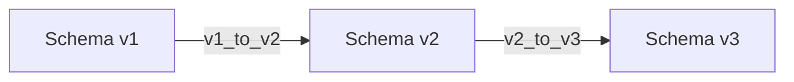

# QuotaGlance 数据库与存储设计说明书

> 文档状态：目标存储设计；`0.1.x` 已有内存态与偏好持久化实现
> 目标版本：`1.0.0`  
> 最后更新：2026-07-14
> 维护联系：`maorongkang@gmail.com`

## 1. 结论

QuotaGlance 1.0.0 不使用数据库，也不使用 MySQL。MVP 计划只持久化少量用户偏好，采用应用配置目录中的版本化 JSON 文件；额度快照、最后成功值、刷新状态和 App Server 请求状态只保存在进程内存中。

未来只有在明确增加“本地历史趋势”功能后才引入嵌入式 SQLite。届时 SQLite 只保存经过规范化和最小化处理的额度采样，不接管用户偏好，也不保存 Token、账号 ID 或 App Server 原始响应。

当前工程已包含内存态快照、刷新状态和运行期偏好 JSON。窗口模式、置顶、穿透、主题与登录时启动偏好已使用临时文件、有效备份和恢复原因落盘；项目仍未创建数据库或迁移文件。

### 1.1 0.1.x 当前实现边界

- 动态 Rust 领域、严格 JSONL、只读常驻 App Server 会话、内存 pending request map、基础刷新状态、10 个 IPC、窗口/托盘偏好、登录时启动和 React UI 已实现。
- 窗口模式、置顶、穿透与主题偏好会在应用重启后恢复；额度快照和最后成功快照仍只保存在内存，项目不使用 MySQL 或 SQLite。
- `preferences.json` 已实现 256 KiB 上限、Schema 校验、临时文件替换、有效备份、损坏恢复和未来版本写保护；完整 Patch/revision 冲突接口、语言、窗口边界、更新器和 sidecar 生产分发仍未完成。

## 2. 为什么 MVP 不使用数据库

MVP 的持久化数据具有以下特点：

- 单用户、单机、单进程写入。
- 数据量通常小于数 KiB。
- 没有联表查询、聚合统计、分页或并发事务需求。
- 额度历史明确不在 1.0.0 范围内。
- 用户偏好需要易迁移、易恢复和可人工检查。

因此数据库带来的驱动、迁移、备份、锁和损坏恢复成本没有对应收益。MySQL 还会要求用户安装并维护独立服务，与本地轻量桌面工具的目标相冲突。

## 3. 存储清单

### 3.1 持久化数据

| 数据 | 载体 | 生命周期 | 是否含敏感信息 |
|---|---|---|---|
| 用户偏好 | `preferences.json` | 跨应用重启 | 否，禁止写入凭据和账号标识 |
| 上一份有效偏好备份 | `preferences.json.bak` | 被下一次有效保存替换 | 同上 |
| 原子写临时文件 | `preferences.json.tmp` | 单次写入过程 | 同上，成功或失败后清理 |
| Tauri/系统插件状态 | 由对应插件或操作系统管理 | 依插件定义 | 仅保存必要设置，不由本文件重复存秘密 |

偏好文件放在 Tauri 提供的 `app_config_dir()` 中。业务代码不得拼接用户目录或允许前端指定保存路径。

### 3.2 仅内存数据

| 数据 | 所有者 | 清理时机 |
|---|---|---|
| 当前 `QuotaSnapshot` | `MemorySnapshotCache` | 被新快照替换或进程退出 |
| 最后成功快照 | `MemorySnapshotCache` | 新成功值替换或进程退出 |
| TTL、退避和冷却时间 | `RefreshScheduler` | 成功后重置或进程退出 |
| App Server Pending 请求 | `AppServerProtocol` | 响应、超时、断连或退出 |
| 通知去抖状态 | `RefreshScheduler` | 合并刷新后或退出 |
| sidecar 进程状态 | `AppServerProcessManager` | 状态转换或退出 |

这些数据不能写入偏好文件、日志、崩溃报告或诊断包。应用重启后没有可展示的历史额度属于 MVP 预期行为。

### 3.3 明确禁止持久化

- OpenAI/Codex Token、Cookie、Authorization Header。
- 邮箱、账号 ID、workspace ID、ChatGPT account ID。
- `auth.json` 路径、keyring 内容或凭据来源的个人路径。
- App Server 原始请求、响应和通知。
- reset credit 的不透明 `id`。
- 提示词、聊天历史、代码、项目路径或项目内容。
- 未经用户明确同意的遥测、崩溃上下文和行为画像。
- 1.0.0 中的任何额度历史。

## 4. 偏好文件 Schema

### 4.1 文件位置与命名

```text
<app_config_dir>/preferences.json
<app_config_dir>/preferences.json.bak
<app_config_dir>/preferences.json.tmp
```

应用只通过 `PreferencesStore` 访问这些文件。React、Tauri Commands 和其他服务不能直接读写路径。

### 4.2 完整示例

以下是 Schema v1 的完整示例。JSON 文件不允许注释。

```json
{
  "schemaVersion": 1,
  "revision": 0,
  "locale": "zh-CN",
  "theme": "system",
  "widget": {
    "mode": "card",
    "alwaysOnTop": true,
    "clickThrough": false,
    "selectedQuota": {
      "limitId": null,
      "slot": null
    },
    "boundsByMode": {
      "orb": null,
      "card": null
    }
  },
  "notifications": {
    "enabled": false,
    "warningRemainingPercent": 50,
    "criticalRemainingPercent": 10,
    "notifyWhenRecovered": false
  },
  "startup": {
    "launchAtLogin": false
  },
  "updates": {
    "autoCheck": true,
    "channel": "stable",
    "lastCheckedAt": null
  }
}
```

### 4.3 顶层字段

| 字段 | 类型 | 必填 | 默认值 | 说明 |
|---|---|---:|---|---|
| `schemaVersion` | 整数 | 是 | `1` | 文件结构版本，与应用版本独立 |
| `revision` | 非负整数 | 是 | `0` | 每次成功保存后递增，用于乐观并发 |
| `locale` | 枚举 | 是 | `zh-CN` | `system`、`zh-CN`、`en` |
| `theme` | 枚举 | 是 | `system` | `system`、`aurora`、`graphite`、`paper`、`sunset`、`honey`、`rose`；旧值 `light`、`dark` 分别兼容迁移为 `aurora`、`graphite` |
| `widget` | 对象 | 是 | 见下文 | 窗口模式、行为和位置 |
| `notifications` | 对象 | 是 | 见下文 | 本地额度提醒偏好 |
| `startup` | 对象 | 是 | 见下文 | 开机启动的期望状态 |
| `updates` | 对象 | 是 | 见下文 | 签名更新检查偏好与最后检查时间 |

### 4.4 `widget`

| 字段 | 类型 | 默认值 | 校验规则 |
|---|---|---|---|
| `mode` | `orb \| card \| hidden` | `card` | 封闭枚举 |
| `alwaysOnTop` | 布尔值 | `true` | 与穿透独立 |
| `clickThrough` | 布尔值 | `false` | 托盘必须提供解除入口 |
| `selectedQuota.limitId` | 字符串或 `null` | `null` | 非空时最多 128 个 Unicode 标量值 |
| `selectedQuota.slot` | `primary \| secondary \| null` | `null` | `limitId=null` 时必须为 `null` |
| `boundsByMode.orb` | `WindowBounds` 或 `null` | `null` | `null` 表示使用平台默认位置 |
| `boundsByMode.card` | `WindowBounds` 或 `null` | `null` | 与浮球位置分开保存 |

`hidden` 不保存独立边界，避免隐藏操作覆盖最后一次可见位置。

### 4.5 `WindowBounds`

```json
{
  "x": 120.0,
  "y": 80.0,
  "width": 136.0,
  "height": 136.0,
  "monitorId": "display-1",
  "scaleFactorAtSave": 1.25
}
```

| 字段 | 类型 | 必填 | 规则 |
|---|---|---:|---|
| `x` | 有限数值 | 是 | 逻辑像素，可暂时为负以支持左侧显示器；恢复时重新校验 |
| `y` | 有限数值 | 是 | 逻辑像素；恢复时重新校验 |
| `width` | 正有限数值 | 是 | 按窗口模式限制最小/最大尺寸 |
| `height` | 正有限数值 | 是 | 按窗口模式限制最小/最大尺寸 |
| `monitorId` | 字符串或 `null` | 是 | 最多 256 个字符，只作恢复提示 |
| `scaleFactorAtSave` | 正有限数值 | 是 | 建议限制为 `0.5..=8.0`，不作为当前缩放真值 |

窗口恢复必须以当前显示器工作区为准，不能信任旧位置仍然可见。详细算法见 [详细设计](./detail-design.md)。

### 4.6 `notifications`

| 字段 | 类型 | 默认值 | 规则 |
|---|---|---:|---|
| `enabled` | 布尔值 | `false` | 只控制本地通知，不改变刷新策略 |
| `warningRemainingPercent` | 整数 | `50` | `0..=100` |
| `criticalRemainingPercent` | 整数 | `10` | `0..=100`，且不大于 warning |
| `notifyWhenRecovered` | 布尔值 | `false` | 从低额度或错误状态恢复时是否通知 |

通知实现必须对同一额度窗口去重，不能因为每次安全重同步重复弹出同一提醒。通知去重状态属于运行时数据，MVP 不需要持久化。

### 4.7 `startup`

| 字段 | 类型 | 默认值 | 说明 |
|---|---|---:|---|
| `launchAtLogin` | 布尔值 | `false` | 用户期望状态；实际状态由平台插件读取和设置 |

当前实现设置登录时启动时，先完成平台调用，再提交偏好原子写入。平台调用失败则保留旧偏好；偏好保存失败时回滚平台状态，回滚失败返回 `STARTUP_OPERATION_FAILED`。应用启动时以平台实际状态覆盖内存中的期望值，避免配置声称已启用而系统实际未启用。

### 4.8 `updates`

| 字段 | 类型 | 默认值 | 规则 |
|---|---|---:|---|
| `autoCheck` | 布尔值 | `true` | 只控制自动检查，不允许静默安装 |
| `channel` | `stable` | `stable` | 1.0.0 只支持 stable；未来新增值需升级 Schema |
| `lastCheckedAt` | RFC 3339 字符串或 `null` | `null` | 仅记录成功发起并完成的检查时间 |

更新签名、下载临时文件和安装器生命周期由 Tauri updater 管理，不存入 `preferences.json`。

## 5. 偏好校验规则

读取和写入使用同一份领域校验器：

1. 文件必须是 UTF-8 JSON 对象，建议大小上限 256 KiB。
2. 数值必须为有限值；拒绝 `NaN`、无穷值和超出实现安全范围的坐标。
3. 枚举仅接受当前 Schema 声明值。
4. 字符串执行长度限制，显示时仍进行 HTML/文本安全转义。
5. `criticalRemainingPercent <= warningRemainingPercent`。
6. `selectedQuota.limitId` 和 `slot` 要么同时有意义，要么同时为 `null`。
7. `revision` 由后端管理，前端 Patch 不能直接设置。
8. `schemaVersion` 由迁移器管理，普通保存不能修改。
9. 未知字段读取时忽略，重新保存时不输出。
10. 任何字段都不允许承载自由格式秘密或原始 Provider 数据。

## 6. 读写、备份与恢复

### 6.1 正常读取

1. 读取 `preferences.json`，先检查大小和 UTF-8。
2. 解析 `schemaVersion`，逐级执行内存迁移。
3. 完整校验后返回 `PreferencesEnvelope`。
4. 文件不存在时返回内置默认值，不必立即创建文件。

### 6.2 异常恢复

| 情况 | 行为 |
|---|---|
| 当前文件不存在 | 使用默认值 |
| 当前文件损坏，备份有效 | 使用备份并提示已恢复；下一次用户保存时重建当前文件 |
| 当前和备份均损坏 | 使用默认值，返回 `PREFERENCES_CORRUPTED`，不覆盖原文件 |
| Schema 版本过旧 | 逐级迁移，校验成功后原子保存新版本 |
| Schema 版本高于当前应用 | 使用安全默认值并返回 `PREFERENCES_VERSION_UNSUPPORTED`，绝不覆盖未来文件 |
| 原子替换失败 | 保留当前文件和旧备份，删除本次临时文件 |

### 6.3 原子写

写入采用“同目录临时文件 + 有效备份 + 平台原子替换”：

```text
获取进程内写锁
→ 复核 expectedRevision
→ 应用 Patch 并完整校验
→ revision + 1
→ 写 preferences.json.tmp
→ flush + sync_all
→ 用当前有效文件更新 .bak
→ 原子替换 .tmp 为 preferences.json
→ 支持时同步父目录
→ 释放写锁并发布事件
```

详细平台约束见 [详细设计](./detail-design.md)。不能通过直接截断并重写当前文件保存偏好。

## 7. Schema 版本与迁移

### 7.1 版本原则

- `schemaVersion` 只在文件结构或语义不兼容变化时增加。
- `revision` 每次成功写入增加，与 Schema 版本无关。
- 应用版本与偏好 Schema 版本独立，例如 QuotaGlance 1.3.0 仍可使用 Schema v1。
- 迁移文件或迁移函数只新增，不修改已经发布的历史迁移语义。

### 7.2 迁移流程



每个迁移函数必须：

- 接收上一版本完整对象，返回下一版本完整对象。
- 不执行文件 I/O，不依赖当前窗口或网络。
- 对同一输入生成确定结果。
- 完成后执行下一版本完整校验。
- 配有正常、边界、缺失字段和损坏输入 fixture。

## 8. 文件权限与隐私

- 配置目录使用操作系统和 Tauri 的标准用户级目录，不写入项目目录或全局共享目录。
- 文件权限采用平台可用的最小用户权限；不因“文件无秘密”而放宽权限。
- 不通过 `.env` 保存任何 Codex 配置或 Token。
- 诊断信息只报告 `preferences.json` 是否存在、Schema 版本和脱敏错误码，不输出绝对路径或文件内容。
- 卸载是否删除偏好遵循平台安装器约定；如未来提供“清除所有数据”，必须明确列出并由用户确认。

## 9. 未来 SQLite 边界

### 9.1 引入条件

只有同时满足以下条件才引入 SQLite：

1. 产品需求明确加入本地额度历史或趋势图。
2. 用户能够查看、配置保留周期并清除历史。
3. 隐私说明和测试文档已更新。
4. 已定义采样频率、去重规则和磁盘上限。
5. 完成 Windows/macOS 数据迁移、损坏恢复和卸载验证。

仅仅为了保存偏好或缓存最后一次快照，不足以引入 SQLite。

### 9.2 文件与职责

建议未来使用：

```text
<app_data_dir>/quota-history.sqlite3
```

- 偏好继续保存在 `preferences.json`。
- SQLite 只保存规范化历史采样。
- App Server 原始 JSON 永不写入数据库。
- 数据库 Schema 版本与偏好 Schema 版本分别管理。

### 9.3 候选表结构

以下仅是未来设计草案，不应在 MVP 中创建。

```sql
CREATE TABLE schema_migrations (
    version INTEGER PRIMARY KEY,
    name TEXT NOT NULL UNIQUE,
    applied_at TEXT NOT NULL
);

CREATE TABLE quota_samples (
    id INTEGER PRIMARY KEY,
    captured_at TEXT NOT NULL,
    source TEXT NOT NULL,
    status TEXT NOT NULL,
    snapshot_schema_version INTEGER NOT NULL,
    available_reset_count INTEGER
);

CREATE TABLE quota_bucket_samples (
    id INTEGER PRIMARY KEY,
    sample_id INTEGER NOT NULL REFERENCES quota_samples(id) ON DELETE CASCADE,
    limit_id TEXT NOT NULL,
    limit_name TEXT,
    rate_limit_reached_type TEXT
);

CREATE TABLE quota_window_samples (
    id INTEGER PRIMARY KEY,
    bucket_sample_id INTEGER NOT NULL
        REFERENCES quota_bucket_samples(id) ON DELETE CASCADE,
    slot TEXT NOT NULL,
    kind TEXT NOT NULL,
    used_percent REAL NOT NULL CHECK (used_percent BETWEEN 0 AND 100),
    remaining_percent REAL NOT NULL CHECK (remaining_percent BETWEEN 0 AND 100),
    window_duration_mins INTEGER NOT NULL CHECK (window_duration_mins > 0),
    resets_at TEXT NOT NULL
);

CREATE INDEX idx_quota_samples_captured_at
    ON quota_samples(captured_at);

CREATE INDEX idx_bucket_limit_sample
    ON quota_bucket_samples(limit_id, sample_id);

CREATE INDEX idx_window_bucket_slot
    ON quota_window_samples(bucket_sample_id, slot);
```

不建议在历史库保存 `planType`、账户类型、邮箱、账号 ID、credit 明细或 reset credit 不透明 ID，因为趋势功能不需要这些字段。

### 9.4 采样与保留建议

- 只在成功完整读取后采样；`stale` 状态不重复写入旧业务值。
- 对相同桶、窗口、百分比和重置时间的连续结果去重，避免安全重同步产生无意义记录。
- 默认保留期建议 30 天，最终值需经过产品确认；用户可立即清除全部历史。
- 清理在事务内按 `captured_at` 删除父记录，依靠外键级联删除子记录。
- 设置数据库磁盘上限，达到上限时优先清理最旧采样，不影响当前额度读取。
- 历史功能关闭后停止新采样；是否立即删除旧数据由用户明确选择。

### 9.5 SQLite 运行约束

若未来实现：

- 启用 `PRAGMA foreign_keys = ON`。
- 桌面单进程写入可评估 WAL，但必须验证休眠、崩溃和杀进程后的恢复。
- 一次完整快照的父、桶和窗口记录在同一事务提交。
- 迁移按编号顺序执行，并在同一事务更新 `schema_migrations`。
- 迁移文件只新增，不修改已经发布的迁移。
- 数据库不可用时降级为“无历史”，不能阻塞当前内存快照和 App Server 刷新。

### 9.6 从 MVP 迁移

MVP 没有持久化额度数据，因此首次启用历史功能时无需把 `preferences.json` 或内存快照迁入 SQLite：

1. 原子保存“历史功能已启用”的未来偏好字段。
2. 创建数据库临时文件并执行全部迁移。
3. 完成完整性检查后启用采样。
4. 从下一次成功额度读取开始写入，不补造过去数据。

如果数据库创建失败，偏好启用状态必须回滚或明确标记未生效，不能让 UI 声称正在记录历史。

## 10. 验收检查

MVP 存储实现至少满足：

- [ ] 首次运行在无文件情况下使用默认偏好。
- [ ] 正常保存产生有效 JSON，revision 只在成功后递增。
- [ ] 并发旧 revision 保存被拒绝，不覆盖新设置。
- [ ] 写入中断、磁盘写满和替换失败后当前文件仍可读取。
- [ ] 当前文件损坏时能使用有效备份恢复。
- [ ] 未来 Schema 文件不会被旧应用覆盖。
- [ ] 显示器标识变化后窗口仍能回到可见区域。
- [ ] 配置目录中不存在额度快照、原始响应、Token、邮箱或账号 ID。
- [ ] 应用退出后内存额度与 Pending 请求全部释放。
- [ ] 工程中没有 MySQL 驱动、连接串、数据库密码或无用迁移目录。
