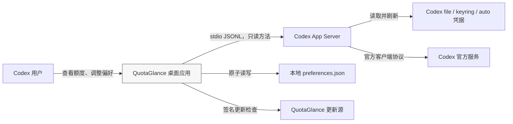
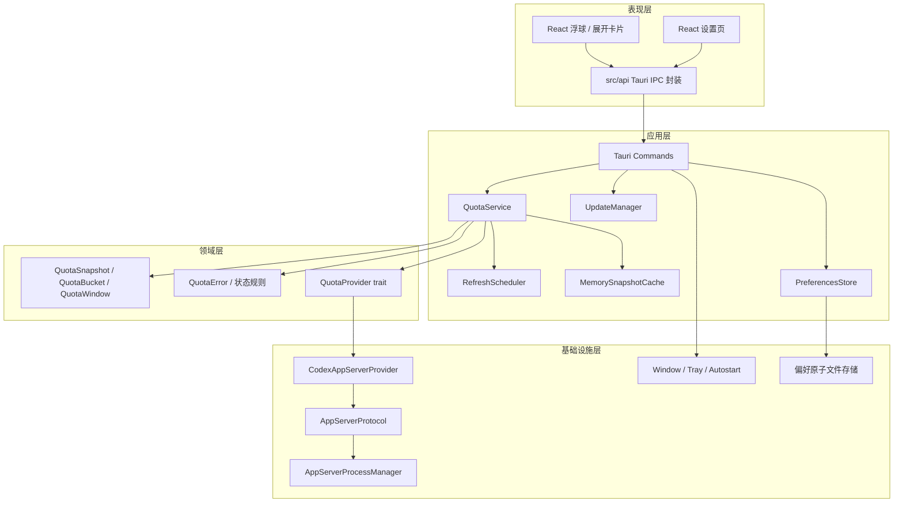
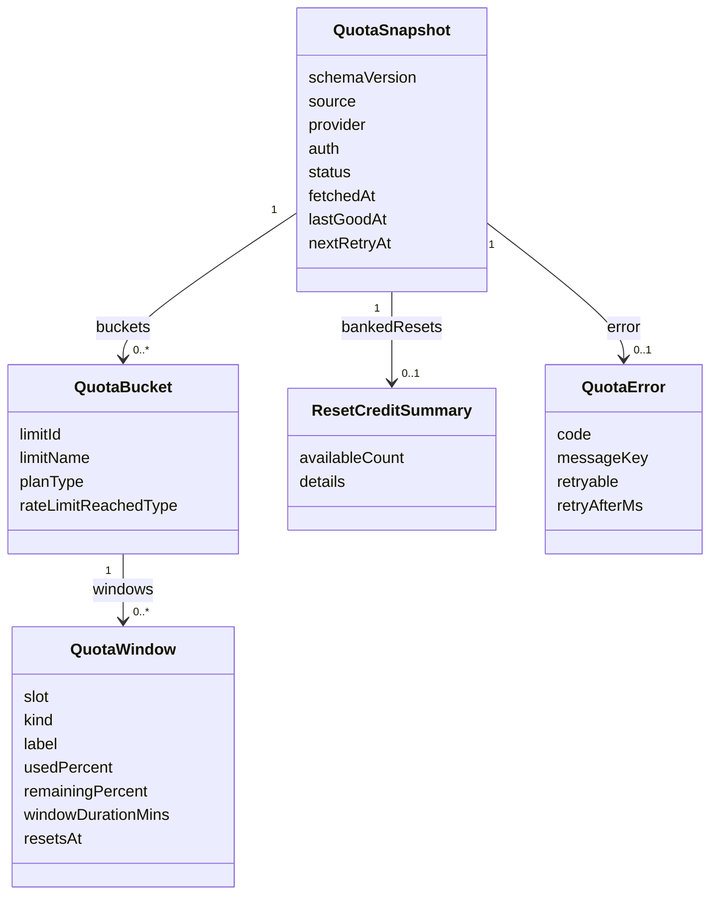
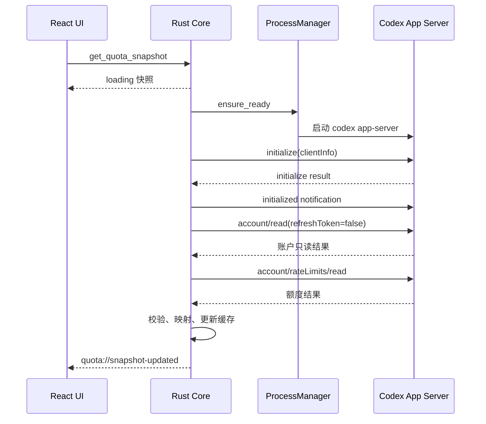
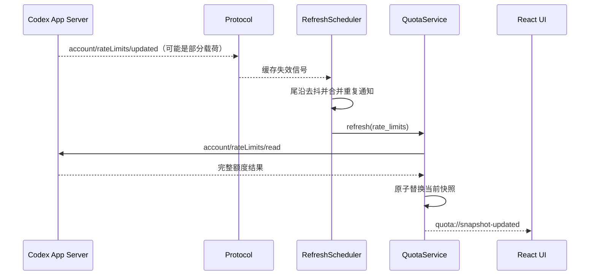
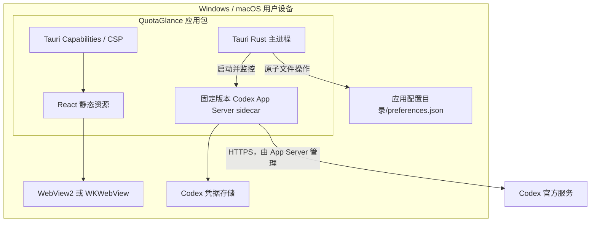

# QuotaGlance 概要设计说明书

> 文档状态：目标设计基线；`0.1.x` 已进入实现阶段
> 目标版本：`1.0.0`  
> 最后更新：2026-07-14
> 维护联系：`maorongkang@gmail.com`

## 1. 文档目的

本文定义 QuotaGlance 1.0.0 的总体架构、模块边界、关键数据流和主要技术决策，作为当前实现、后续迭代和测试的共同基线。

当前工作区已经建立 Tauri 2、Rust 与 React/TypeScript 工程。本文描述的是 1.0.0 目标架构；除下节明确列出的 0.1.x 能力外，其余模块、完整语义和部署结构仍按目标设计管理。

### 1.1 0.1.x 当前实现边界

- 已实现动态 Rust 领域模型、严格 JSONL 协议校验、只读常驻 App Server 会话、pending request map、基础刷新状态、10 个 IPC、窗口/托盘偏好以及 React UI。
- 已实现的 IPC 为 `get_quota_snapshot`、`refresh_quota`、`get_app_server_status`、`get_preferences`、`set_theme`、`set_widget_mode`、`set_always_on_top`、`set_click_through`、`set_launch_at_login`、`quit_app`。
- 当前应用复用一个 App Server 会话，已知账号/额度通知会触发防抖后的完整重读；已实现 30 秒自动刷新缓存、SingleFlight、最后成功快照、可见/隐藏重同步和退避恢复。
- 窗口模式、置顶、穿透、主题和登录时启动偏好已落盘并支持失败恢复；语言、窗口边界、更新器和 sidecar 生产分发仍是后续实施内容。

## 2. 系统目标与边界

QuotaGlance 是一个面向 Windows、macOS 和 Linux 的本地桌面额度助手。它通过浮球、展开卡片和系统托盘，近实时展示当前 Codex 额度桶、额度窗口、剩余比例、重置时间和数据状态；其中 Linux 当前属于社区预览支持，正式支持范围仍以发布验收结果为准。

### 2.1 核心目标

- 使用 Codex App Server 的公开本地协议读取登录状态和 ChatGPT 额度。
- 将服务端的动态额度桶转换为稳定的本地域模型，不把“五小时”和“周额度”固化成唯一结构。
- 通知到达后快速刷新，同时以低频安全重同步弥补通知丢失。
- 刷新失败时保留最后一次成功结果，并明确标记旧数据。
- 在不接触 Token 的前提下支持 Codex 的正常认证存储方式。
- 提供可找回、可置顶、可穿透、支持多显示器的轻量桌面窗口。

### 2.2 明确不在 1.0.0 范围内

- 不提供登录、登出或修改账户的能力。
- 不消费额度重置次数，不发送额度提醒邮件，不执行任何 App Server 账号写操作。
- 不保存额度历史，不生成趋势图或用户画像。
- 不建设服务端，不开放本地 REST、TCP 或 WebSocket 端口。
- 不使用 MySQL；MVP 也不引入 SQLite。
- 不在 WebView 中直接访问 Codex 或 ChatGPT 服务。
- 不提供直接读取凭据或调用非公开接口的兼容 Provider。

## 3. 架构约束

| 约束 | 设计响应 |
|---|---|
| 本地优先 | 业务、缓存和偏好均在本机处理，不依赖 QuotaGlance 自建服务 |
| 凭据隔离 | 正常路径由 App Server 处理认证；QuotaGlance 不读 `auth.json`、不访问 keyring、不持有 Token |
| 只读产品 | App Server 方法采用显式允许列表，只允许初始化、账户读取、额度读取和相关通知 |
| 协议可能演进 | 固定并验证 sidecar 版本，生成对应版本协议 Schema，解析时兼容可选字段和未知枚举 |
| 动态额度体系 | 使用 `buckets[]` 和 `windows[]`，优先解析 `rateLimitsByLimitId` |
| 常驻低开销 | 调度位于 Rust/Tokio，WebView 不承担轮询；隐藏状态降低安全重同步频率 |
| 双平台窗口差异 | 共用业务层，窗口、托盘、DPI、签名和 sidecar 启动按平台实机验证 |
| 错误不可伪装成额度 | 未知或解析失败进入明确状态，不以 `0%` 代替缺失值 |

## 4. 系统上下文



信任边界如下：

1. React WebView 是低权限展示层，只能通过细粒度 Tauri Commands 与 Rust 通信。
2. Rust Core 是应用可信边界，负责参数校验、协议解析、状态机、缓存和平台能力。
3. App Server 是独立子进程，持有并管理 Codex 认证；QuotaGlance 只与其标准输入输出通信。
4. 外部网络由 App Server 和独立的签名更新模块访问，WebView 不具备任意网络权限。

## 5. 分层架构



### 5.1 表现层

- 只接收规范化后的领域数据，不解析 App Server 原始消息。
- 所有 IPC 调用集中在 `src/api/`，组件内不直接调用 Tauri `invoke`。
- 负责展示、交互、国际化和可访问性，不负责刷新定时和剩余比例计算。
- 额度、认证和 App Server 状态通过事件更新；重新加载页面时可通过命令取得当前完整状态。

### 5.2 应用层

- 编排用例，处理 IPC 权限、输入校验和结果序列化。
- `QuotaService` 形成一致快照；`RefreshScheduler` 决定何时读取；缓存负责最后成功值和新鲜度。
- 偏好、更新和窗口能力与额度 Provider 分离，任何更新失败都不能阻塞额度读取。

### 5.3 领域层

- 不依赖 Tauri、进程、JSONL 或具体 UI 框架。
- 定义稳定的额度语义、状态转换和错误分类。
- 将外部可变枚举保留为安全字符串或 `unknown`，避免新增服务端值导致反序列化崩溃。

### 5.4 基础设施层

- 管理 App Server sidecar、协议收发、文件存储和操作系统能力。
- 对外部数据执行大小、格式、范围和超时校验。
- 所有日志都经过脱敏，不记录原始协议消息、账户信息、Token 或用户路径。

## 6. 核心模块

| 模块 | 主要职责 | 不承担的职责 |
|---|---|---|
| `CodexAppServerProvider` | 调用允许的账户与额度读取方法，把响应映射为领域模型 | 不管理窗口，不向 UI 发送原始响应 |
| `AppServerProcessManager` | 定位、校验、启动、监控和停止 sidecar，执行重启退避 | 不解析额度字段 |
| `AppServerProtocol` | JSONL 编解码、请求 ID 匹配、通知分发、超时和协议错误处理 | 不计算剩余额度，不决定刷新周期 |
| `QuotaService` | 合并认证、额度、缓存和错误，发布一致快照 | 不直接管理子进程 |
| `RefreshScheduler` | 启动读取、通知去抖、安全重同步、手动刷新冷却和退避 | 不依赖 WebView 定时器 |
| `MemorySnapshotCache` | 保存当前状态、最后成功快照、TTL 和下一次重试时间 | 不落盘保存额度历史 |
| `PreferencesStore` | 校验、迁移和原子保存用户偏好 | 不保存 Token、原始额度或账号 ID |
| `WindowManager` | 模式切换、位置恢复、置顶、穿透、多屏和 DPI 适配 | 不决定额度展示内容 |
| `TrayManager` | 显示/隐藏、解锁穿透、打开设置和真正退出 | 不直接访问 Provider |
| `UpdateManager` | 检查和安装签名更新 | 不与额度刷新共享状态机 |

## 7. 领域模型概览



额度口径统一为“剩余比例”：

```text
remainingPercent = 100 - usedPercent
```

该计算只在 Rust Provider 中执行一次。`usedPercent` 必须是有限数值且位于 `0..=100`；不合法值不得钳制成看似正常的数据。若某一窗口不合法，则隔离该窗口；所有可用窗口都无法解析时，保留最后成功值并进入 `incompatible`。

五小时和一周只是常见窗口映射。领域层始终保留 `windowDurationMins`，无法确认语义时将 `kind` 设为 `unknown`，UI 使用时长生成中性标签。

## 8. 关键数据流

### 8.1 启动与首次读取



每个传输连接只能初始化一次。1.0.0 不设置 `experimentalApi: true`，只使用稳定协议面；`clientInfo.name` 固定为 `quota_glance`，同时提供真实标题和应用版本。

### 8.2 额度通知刷新



通知载荷不是完整快照的可信来源。收到 `account/rateLimits/updated` 后必须重新调用 `account/rateLimits/read`；收到 `account/updated` 后必须先重读账户，再按认证状态决定是否读取额度。

### 8.3 失败与恢复

- 刷新失败且存在成功快照：保留原值，状态改为 `stale`，记录 `lastGoodAt` 和 `nextRetryAt`。
- 刷新失败且无成功快照：返回明确错误状态，`buckets` 为空，不生成假百分比。
- App Server 退出：失败所有在途请求，进入进程重启退避；恢复握手后执行账户和额度完整重读。
- 窗口由隐藏变为可见、系统从睡眠唤醒或网络恢复时，快照超过 60 秒则触发重读。
- 正常可见时每 5 分钟、仅托盘驻留时每 10 分钟安全重同步。

## 9. App Server 集成边界

QuotaGlance 1.0.0 只允许以下 App Server 协议交互：

| 类型 | 方法 | 用途 |
|---|---|---|
| 请求 | `initialize` | 建立连接并声明客户端信息 |
| 通知 | `initialized` | 确认初始化完成 |
| 请求 | `account/read` | 读取认证类型和套餐；固定 `refreshToken=false` |
| 通知 | `account/updated` | 账户状态失效信号 |
| 请求 | `account/rateLimits/read` | 读取完整额度视图 |
| 通知 | `account/rateLimits/updated` | 额度缓存失效信号 |

禁止调用的操作包括但不限于：

- `account/login/start`
- `account/login/cancel`
- `account/logout`
- `account/rateLimitResetCredit/consume`
- `account/sendAddCreditsNudgeEmail`
- 任意 thread、turn、shell、文件写入或会改变远端/本地状态的方法

协议与字段详情见 [接口设计说明书](./api.md)。官方依据为 [Codex App Server 文档](https://developers.openai.com/codex/app-server/)，本次核对日期为 2026-07-12；实现时还必须用固定 sidecar 运行 `generate-ts` 或 `generate-json-schema`，以该版本生成物补充契约测试。

## 10. 部署视图



### 10.1 Windows

- 1.0.0 基线为 Windows 11 x64；Windows 10 22H2 ESU 尽力支持。
- sidecar 与应用架构一致，随安装包校验版本、哈希和签名。
- 不依赖 Codex 桌面应用的 WindowsApps 内部路径。
- WebView 使用 WebView2 Evergreen；公开安装包完成 Authenticode 签名。

### 10.2 macOS

- 1.0.0 基线为 macOS 13 及以上，覆盖 Apple Silicon 和 Intel。
- 优先生成 Universal 应用与 Universal sidecar；无法稳定合并时发布两套已签名、公证的架构包。
- 应用和 sidecar 均纳入 Developer ID 签名、公证与 Gatekeeper 验证。
- 首版采用站外 DMG 分发，不以 Mac App Store 沙盒为交付前提。

### 10.3 App Server 运行组件来源顺序

以下是 1.0.0 bundled sidecar 的目标顺序：

1. 正式包内经过固定版本、哈希和签名验证的 sidecar。
2. 用户在设置中明确选择且通过校验的外部 Codex CLI。
3. 仅开发构建可从 PATH 发现 CLI，用于 POC 和契约测试。

`0.1.5` 社区预览不携带 sidecar，当前实现按平台发现用户已经安装的外部运行组件：Windows 先检查 Codex 桌面应用管理的运行副本，再检查 `PATH`；macOS 依次检查 `/Applications/ChatGPT.app`、`~/Applications/ChatGPT.app`、`/Applications/Codex.app`、`~/Applications/Codex.app` 内固定的 `Contents/Resources/codex`，随后检查 `PATH` 和常见 CLI 目录；Linux 先检查 `PATH`，再检查常见 CLI 目录。debug 构建还允许通过 `QUOTAGLANCE_CODEX_PATH` 指定绝对路径。当前外部候选尚未完成版本兼容、bundle identifier 或发行者签名校验，不能视为正式受信任的 bundled sidecar。

任何来源都只能以固定参数 `app-server` 启动，不接受来自前端的可执行路径、命令行参数或环境变量透传。

## 11. 安全设计摘要

- WebView 不获得通用文件系统、Shell、进程或任意网络权限。
- Tauri Commands 按窗口标签授权；设置窗口才能修改偏好和安装更新。
- IPC 输入有长度、枚举和范围校验，返回错误使用脱敏错误码与本地化键。
- App Server 使用默认 `stdio` JSONL，不监听本地端口。
- 单条协议消息、待处理请求数和请求时间均设置上限。
- 不把 `account/read` 中的邮箱发送到前端，也不保存账户 ID 或原始响应。
- reset credit 明细中的不透明 `id` 不提供给 UI，因为 1.0.0 不支持消费操作。
- 默认不启用遥测；日志只记录状态转换、耗时和脱敏错误码。

## 12. 架构决策记录

| 编号 | 决策 | 原因 | 主要代价 |
|---|---|---|---|
| ADR-001 | 使用 Tauri 2 + Rust + React + TypeScript | 兼顾常驻资源、跨平台 UI、进程管理和严格 IPC | 需要维护 Rust 与前端两套工程能力 |
| ADR-002 | 官方 App Server 为首选数据源 | 认证和额度协议由 Codex 官方进程处理，应用不接触 Token | 受 sidecar 版本、许可、签名和协议兼容性约束 |
| ADR-003 | 使用默认 `stdio` JSONL | 无监听端口、边界小、适合父子进程生命周期 | 需要可靠处理行协议、子进程退出和背压 |
| ADR-004 | 1.0.0 不启用实验性 App Server API | 降低协议漂移和发布风险 | 无法使用仅实验性提供的能力 |
| ADR-005 | 产品能力严格只读 | 额度查看工具无需账户或配额写入，最小权限更容易审计 | 用户需在官方 Codex 界面完成登录和其他操作 |
| ADR-006 | 使用动态额度桶模型 | 兼容多 `limitId`、可选窗口和未来额度变化 | UI 与测试必须覆盖未知桶和未知窗口 |
| ADR-007 | 通知驱动 + 安全重同步 | 兼顾更新速度与漏通知恢复 | 存在少量周期性读取开销 |
| ADR-008 | 额度快照仅驻留内存 | MVP 无历史需求，减少隐私和迁移成本 | 应用重启后没有旧快照可展示 |
| ADR-009 | 偏好保存为原子 JSON | 数据量小、易检查、无需数据库生命周期 | 需自行处理 Schema 迁移、并发写和损坏恢复 |
| ADR-010 | 不建设本地 REST 服务 | Tauri IPC 足够，避免端口、鉴权和本地攻击面 | 前端不能脱离桌面主进程独立访问业务能力 |
| ADR-011 | Legacy Provider 隔离且默认关闭 | 保留显式降级空间，不污染官方主路径 | 需要单独安全审计，且不计入主路径可用性 |

## 13. 质量属性与设计目标

| 属性 | 设计目标 | 实现验证方式 |
|---|---|---|
| 正确性 | 不把未知值显示为 0；多桶、可选字段独立降级 | Parser 契约测试、领域模型单元测试 |
| 可恢复性 | 进程退出、离线、睡眠和漏通知后可自动恢复 | 可控时钟测试、故障注入、双平台实机测试 |
| 性能 | 正常网络下 15 秒内给出额度或明确错误；空闲 CPU 目标低于 0.5% | 启动计时、长期驻留采样 |
| 资源占用 | 应用与 App Server 空闲内存合计目标不高于 150 MiB | Windows/macOS 发布构建实测 |
| 安全 | 正常路径不接触 Token，WebView 无任意网络与 Shell 能力 | Capability 审查、日志扫描、运行时验证 |
| 可维护性 | Provider、协议、进程和领域层可独立测试 | trait 注入、fixture、固定 Schema 契约测试 |
| 可访问性 | 键盘可操作、状态不只依赖颜色、文本达到 AA 对比度 | 前端自动化与人工辅助技术检查 |

以上数值是 1.0.0 工程目标，不是当前实测结果。

## 14. 待验证事项

在进入正式 UI 开发前，M0 POC 必须回答以下问题：

1. 固定版本 App Server sidecar 在 Windows x64、macOS Intel 和 Apple Silicon 上能否合法分发、签名并稳定启动。
2. `account/read` 在 file、keyring、auto 认证存储下的实际返回是否符合生成 Schema。
3. `account/rateLimits/read` 的单桶、多桶、credits 和 reset credits 在目标账号矩阵中的实际形态。
4. 更新通知是否可能乱序、重复或只携带部分字段，以及完整重读后的收敛行为。
5. App Server 缺失、过旧、拒绝执行和上游离线时的可区分错误特征。
6. Windows 与 macOS 上多屏、DPI、穿透和托盘找回行为是否满足验收标准。

验证结论应回写本文、[详细设计说明书](./detail-design.md)、[接口设计说明书](./api.md)和测试文档，不得仅保留在临时记录中。
