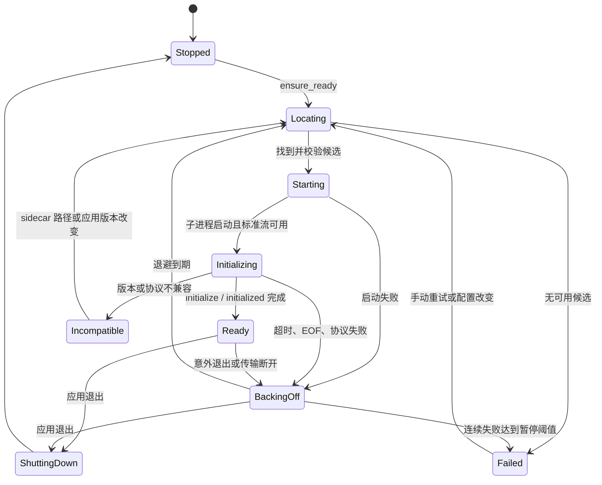
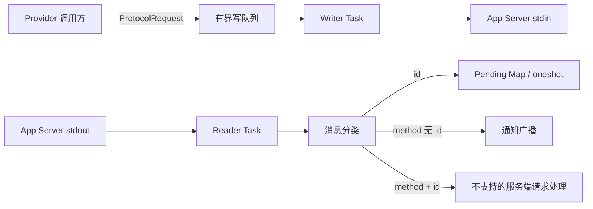
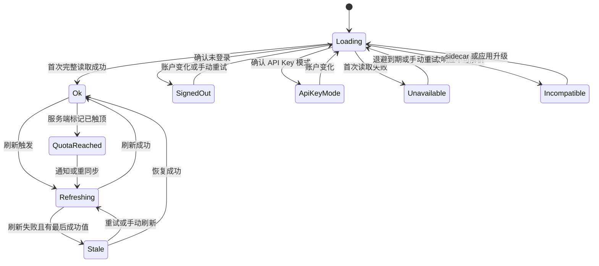
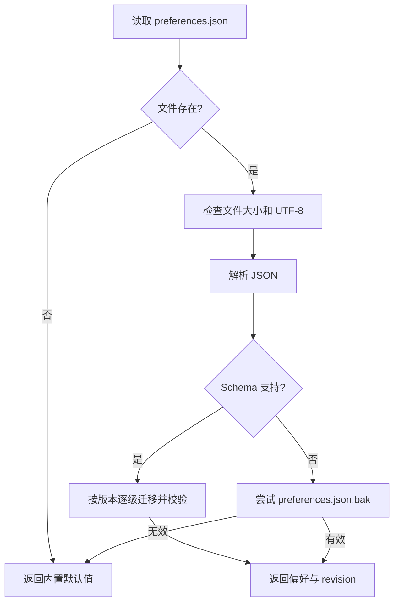
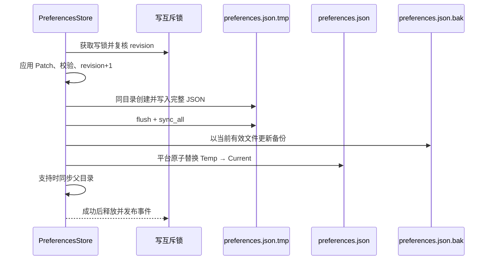

# QuotaGlance 详细设计说明书

> 文档状态：目标详细设计；`0.1.x` 已实现首批模块
> 目标版本：`1.0.0`  
> 最后更新：2026-07-13  
> 维护联系：`maorongkang@gmail.com`

## 1. 设计说明

本文把 [概要设计](./design.md) 细化为可直接编码和测试的 Rust 核心设计，重点覆盖 App Server 进程管理、JSONL 协议、状态机、缓存与刷新调度、窗口恢复和偏好原子写入。

本文中的常量是 1.0.0 首轮实现建议，不是当前实测值。M0 POC 若发现固定版本 App Server 的行为不同，必须先补充协议 fixture 和测试结论，再调整设计。

### 1.1 0.1.x 当前实现边界

- 已实现动态 Rust 领域模型、严格 JSONL 大小与消息校验、只读常驻 App Server 会话、pending request map，以及基础刷新状态。
- 已建立 `test-support` 假 App Server 和 9 项跨进程契约；假服务不会进入默认 Tauri 构建，也不能替代真实 sidecar 兼容性验证。
- 已接通 `get_quota_snapshot`、`refresh_quota`、`get_app_server_status`、`get_preferences`、`set_theme`、`set_widget_mode`、`set_always_on_top`、`set_click_through`、`quit_app` 9 个 IPC，并完成基础窗口、托盘和 React UI。
- App Server 已按应用进程复用常驻连接；通知驱动、30 秒自动刷新缓存、SingleFlight、最后成功快照、可见/隐藏定时重同步和刷新退避已实现。
- 窗口模式、置顶、穿透和主题偏好已原子落盘并支持备份恢复；完整偏好 Patch/revision 冲突、语言、窗口边界、更新器、生产 sidecar 定位与分发尚未实现。

## 2. 目标目录与模块

```text
src-tauri/src/
  app.rs
  lib.rs
  main.rs
  commands/
    mod.rs
    quota.rs
    preferences.rs
    window.rs
    update.rs
  domain/
    mod.rs
    models.rs
    errors.rs
    status.rs
  providers/
    mod.rs
    codex/
      mod.rs
      app_server.rs
      process.rs
      protocol.rs
      parser.rs
      schema/                 # 固定 sidecar 生成的协议类型或受控包装
    legacy_wham.rs            # 默认关闭，单独编译特性或显式设置启用
  services/
    mod.rs
    quota_service.rs
    refresh_scheduler.rs
    snapshot_cache.rs
    preferences.rs
    updater.rs
  platform/
    mod.rs
    window.rs
    tray.rs
    autostart.rs
  storage/
    mod.rs
    atomic_file.rs
```

### 2.1 依赖方向

```text
commands → services → domain
services → providers trait
providers/codex → process + protocol + parser → domain
services/preferences → storage/atomic_file
commands/window → platform/window
```

`domain` 不得反向依赖 Tauri、Tokio、Serde JSON 或操作系统 API。`commands` 不直接持有子进程，不直接解析 App Server 响应。

### 2.2 模块职责

| 模块 | 输入 | 输出 | 关键约束 |
|---|---|---|---|
| `process.rs` | 固定 sidecar 元数据、外部 CLI 显式路径 | 已启动子进程及标准流、进程状态事件 | 禁止 Shell 拼接和任意参数 |
| `protocol.rs` | stdin/stdout、请求方法与参数 | 匹配的响应、类型化通知 | 一行一消息、请求超时、有限队列 |
| `parser.rs` | 固定版本 Schema 对象 | 领域对象或可分类解析错误 | 不依赖 UI，不伪造缺失值 |
| `app_server.rs` | 账户/额度读取用例 | `ProviderSnapshot`、失效通知 | 显式方法允许列表，只读 |
| `quota_service.rs` | Provider 结果、缓存和刷新原因 | 一致的 `QuotaSnapshot` | 失败保留最后成功值 |
| `refresh_scheduler.rs` | 启动、通知、手动、定时、恢复触发 | 合并后的刷新任务 | SingleFlight、去抖、冷却、退避 |
| `snapshot_cache.rs` | 成功结果或错误状态 | 当前快照、最后成功快照 | MVP 只驻留内存 |
| `preferences.rs` | 偏好 Patch | 校验后的偏好及修订号 | 乐观并发、原子替换、备份恢复 |
| `platform/window.rs` | 模式与窗口设置 | 实际窗口状态 | 多屏拔插后必须可找回 |

## 3. 核心领域类型

以下为结构示意，最终字段名称和序列化形态以 [接口设计](./api.md) 为准。

```rust
pub struct QuotaSnapshot {
    pub schema_version: u32,
    pub revision: u64,
    pub source: Option<QuotaSource>,
    pub provider: String,
    pub auth: AuthSummary,
    pub buckets: Vec<QuotaBucket>,
    pub banked_resets: Option<ResetCreditSummary>,
    pub status: QuotaStatus,
    pub fetched_at: Option<Timestamp>,
    pub last_good_at: Option<Timestamp>,
    pub next_retry_at: Option<Timestamp>,
    pub error: Option<QuotaError>,
}

pub struct QuotaBucket {
    pub limit_id: String,
    pub limit_name: Option<String>,
    pub plan_type: Option<String>,
    pub windows: Vec<QuotaWindow>,
    pub credits: Option<CreditSummary>,
    pub rate_limit_reached_type: Option<String>,
}

pub struct QuotaWindow {
    pub slot: WindowSlot,
    pub kind: WindowKind,
    pub label: String,
    pub used_percent: f64,
    pub remaining_percent: f64,
    pub window_duration_mins: u32,
    pub resets_at: Timestamp,
}
```

领域时间统一为 UTC 时间点，IPC 序列化为 RFC 3339 字符串。外部 `resetsAt` 是 Unix 秒，转换只发生在 Parser 中。

### 3.1 外部字符串处理

- `limitId`、`limitName`、`planType` 和 `rateLimitReachedType` 均设置合理长度上限，建议分别为 128、256、128、128 个 Unicode 标量值。
- 未知 `planType` 或 `rateLimitReachedType` 作为普通字符串保留，不因新增枚举值导致整个响应失败。
- 所有面向日志的外部字符串只记录“存在/不存在”和脱敏错误码，不记录原值。
- `limitName` 只作为辅助显示；不存在时使用 `limitId` 的安全转义结果，不猜测产品名称。

### 3.2 窗口类型映射

`windowDurationMins` 是可信的基础事实，`kind` 只是 UI 友好分类：

| 时长 | `kind` | 默认标签 |
|---:|---|---|
| `300` | `shortTerm` | 五小时 |
| `10080` | `weekly` | 一周 |
| `40320`、`43200`、`44640` | `monthly` | 28 天、30 天或 31 天 |
| 其他正整数 | `unknown` | 按分钟、小时或天数格式化 |

不能因为 `slot=primary` 就认定是五小时，也不能因为 `slot=secondary` 就认定是周额度。

## 4. App Server 进程管理

### 4.1 状态模型



IPC 中使用小写字符串表示这些状态：`stopped`、`locating`、`starting`、`initializing`、`ready`、`backingOff`、`failed`、`incompatible`、`shuttingDown`。

### 4.2 候选定位与校验

候选顺序固定如下：

1. 正式应用包内、与当前目标架构匹配的 sidecar。
2. 用户在设置中明确选择、已规范化并通过版本校验的外部 Codex CLI。
3. 仅开发构建允许从 PATH 发现 `codex`，不能进入正式发布默认路径。

随包 sidecar 的发布元数据至少包括：

```text
version
targetTriple
sha256
sourceUrl
licenseId
```

启动前执行以下检查：

- 路径规范化后仍位于预期应用资源目录，或与用户显式保存的外部路径一致。
- 文件存在、是普通文件、架构匹配且可执行。
- 随包文件 SHA-256 与构建清单一致；正式安装包同时完成操作系统签名验证。
- 外部 CLI 版本位于当前应用声明的兼容范围。
- 不依赖 WindowsApps 内部路径，不扫描其他桌面应用的私有目录。

前端不能传入可执行路径。外部路径选择由后端受控文件选择流程完成，保存前完成规范化和校验。

### 4.3 启动参数与环境

子进程直接通过操作系统进程 API 启动，不经过 PowerShell、`cmd.exe`、`sh` 或其他 Shell：

```text
<validated-codex-path> app-server
```

- 标准输入、标准输出和标准错误均使用管道。
- 不传入 `--listen ws://...`；默认使用 `stdio`。
- 不从 IPC 接收附加参数或环境变量。
- `CODEX_HOME`、平台运行所需变量和系统代理变量只能从父进程受控继承；实现前通过 POC 确认最小集合。
- 任何环境变量值都不得写入日志或错误详情。
- 发布构建不记录原始 stderr。开发构建也只允许在用户明确开启诊断且完成脱敏后查看有限内容。

### 4.4 生命周期与唯一所有者

- `AppServerProcessManager` 是子进程的唯一所有者，应用内只允许一个活动 App Server 实例。
- 每次启动分配递增 `generation`。协议响应、超时和退出事件必须携带 generation，旧连接事件不得修改新连接状态。
- 子进程意外退出时关闭写队列，并用 `APP_SERVER_EXITED` 失败所有待处理请求。
- 应用退出时先停止刷新调度，再关闭 stdin；等待短暂宽限期后仍未退出才终止本应用启动的子进程。
- 不终止用户自行启动的其他 Codex 进程。

### 4.5 重启退避

进程启动或握手失败采用：

```text
1 秒 → 2 秒 → 5 秒 → 15 秒 → 30 秒
```

每档加入 `±10%` 随机抖动。连续失败到最后一档后保持低频 30 秒重试；若发布实测发现故障风暴，允许在 10 次连续失败后暂停自动重启，等待手动重试、sidecar 配置变化、网络恢复或应用重启。

连接保持 `ready` 至少 5 分钟后，进程失败计数清零。

## 5. JSONL 协议设计

### 5.1 线路格式

Codex App Server 默认传输使用省略 `"jsonrpc":"2.0"` 字段的 JSON-RPC 2.0 形态：

```json
{"method":"account/rateLimits/read","id":3}
{"id":3,"result":{"rateLimits":null}}
{"method":"account/rateLimits/updated","params":{"rateLimits":{}}}
```

规则如下：

- UTF-8 编码，一行一条完整 JSON 消息，以 `\n` 结束；接收时兼容 `\r\n`。
- Writer 必须使用 JSON 序列化器，不通过字符串拼接构造消息。
- 请求包含 `method`、可选 `params` 和 `id`；响应包含相同 `id` 以及 `result` 或 `error` 二选一；通知没有 `id`。
- 初始单行上限建议为 1 MiB，超过上限立即终止该连接并返回 `PROTOCOL_MESSAGE_TOO_LARGE`。
- Writer 队列建议上限 64，待处理请求建议上限 32。超过上限返回本地 `SOURCE_BUSY`，不能无限占用内存。
- 空白行可以忽略；非空畸形 JSON 视为连接级协议错误并重启，不尝试从不可信状态继续。

### 5.2 任务划分



- Reader 是 stdout 的唯一读取者。
- Writer 是 stdin 的唯一写入者，保证单条 JSON 不交错。
- 每个会话拥有独立 Pending Map，以 `requestId` 为键、oneshot 响应发送端为值；会话实例本身构成 generation 边界，旧会话不能路由到新会话的 map。
- 请求 ID 使用当前连接内单调递增的无符号整数，重连后可从 1 重新开始，因为 generation 隔离旧响应。
- 超时任务必须从 Pending Map 移除对应项；超时后到达的迟响应只记录脱敏计数，不重新完成调用。

### 5.3 消息分类

按以下顺序判断：

1. 有 `id` 且存在 `result` 或 `error`：响应，匹配 Pending Map。
2. 有 `method` 且无 `id`：通知，按方法允许列表分发。
3. 有 `method` 且有 `id`：App Server 发起的请求。
4. 其他结构：协议错误。

1.0.0 不启用 `experimentalApi`，也不声明 attestation 等能力。遇到不支持的服务端请求时，协议层返回 JSON-RPC `-32601`，消息使用固定英文协议文本，不回显参数。未知通知安全忽略并增加脱敏指标，不能使主进程崩溃。

### 5.4 初始化握手

每个连接严格执行一次：

```json
{
  "method": "initialize",
  "id": 1,
  "params": {
    "clientInfo": {
      "name": "quota_glance",
      "title": "QuotaGlance",
      "version": "1.0.0"
    }
  }
}
```

收到成功响应后发送：

```json
{"method":"initialized","params":{}}
```

不发送 `capabilities.experimentalApi=true`。握手前禁止发送账户或额度请求；重复初始化视为程序缺陷。初始化建议超时 10 秒，额度/账户读取建议单次超时 10 秒，最终以 POC 的正常与代理网络数据校准。

### 5.5 Schema 管理

固定 sidecar 版本后，在构建或协议更新流程中执行：

```bash
codex app-server generate-json-schema --out ./schemas
```

或：

```bash
codex app-server generate-ts --out ./schemas
```

生成物与 sidecar 版本绑定。项目只提交经过审查且测试使用的 Schema；升级 sidecar 时必须同时更新：

1. sidecar 版本、哈希和许可记录；
2. Schema 生成物；
3. 脱敏协议 fixture；
4. Parser 契约测试；
5. 兼容范围与 changelog。

## 6. Codex Provider 设计

### 6.1 允许方法

Provider 只暴露以下内部能力：

```rust
pub trait QuotaProvider {
    async fn read_account(&self) -> Result<AccountSummary, ProviderError>;
    async fn read_rate_limits(&self) -> Result<ProviderQuotaData, ProviderError>;
    fn subscribe_invalidations(&self) -> InvalidationStream;
}
```

`CodexAppServerProvider` 内部使用固定方法名，不接受调用方提供任意字符串。方法允许列表只有：

- `initialize`
- `initialized`
- `account/read`
- `account/rateLimits/read`
- `account/updated`
- `account/rateLimits/updated`

### 6.2 账户读取与归一化

账户请求固定为：

```json
{"method":"account/read","id":2,"params":{"refreshToken":false}}
```

`account/read` 和 `account/updated` 的枚举拼写不同，必须在 Provider 中统一。当前官方 `account/updated.authMode` 已列出 `apikey`、`chatgpt`、`chatgptAuthTokens`、`agentIdentity`、`personalAccessToken`、`bedrockApiKey` 和 `null`；未来值按 `unknown` 处理。

| App Server 值 | 内部 `rawMode` | UI 状态 | 额度读取策略 |
|---|---|---|---|
| `account.type=apiKey` 或 `authMode=apikey` | `apikey` | `apiKeyMode` | 不把 API 按量计费显示成订阅窗口 |
| `chatgpt` | `chatgpt` | `authenticated` | 读取 ChatGPT 额度 |
| `chatgptAuthTokens` | `chatgptAuthTokens` | `authenticated` | 读取额度，未知失败正常分类 |
| `agentIdentity` | `agentIdentity` | `authenticated` | 读取额度，按服务端结果显示 |
| `personalAccessToken` | `personalAccessToken` | `authenticated` | 读取额度，按服务端结果显示 |
| `amazonBedrock` 或 `bedrockApiKey` | `bedrockApiKey` | `externalProvider` | 不显示 ChatGPT 订阅额度 |
| `null` 且需要 OpenAI 认证 | `null` | `signedOut` | 停止高频额度读取 |
| 未知字符串 | 原值经长度校验 | `unknown` | 尝试只读额度一次，失败后低频重试 |

`account/read` 返回的邮箱必须在 Parser 层丢弃，不进入领域模型、IPC、日志或配置。`requiresOpenaiAuth=false` 且账户为空时不能简单认定程序故障，应归一化为可运行的外部 Provider 状态。

### 6.3 额度读取

请求不带业务参数：

```json
{"method":"account/rateLimits/read","id":3}
```

解析顺序：

1. `rateLimitsByLimitId` 存在时，将其视为权威多桶视图，包括空对象。
2. 该字段缺失时，使用向后兼容的单桶 `rateLimits`。
3. 两者均缺失或为 `null` 时，依据认证状态返回“无订阅额度”或结构不兼容，不能创建空的 0% 额度桶。
4. 多桶 Map 的键必须与桶内 `limitId` 一致；不一致桶单独判为不兼容。
5. 每个桶分别解析 `primary` 和可选 `secondary`，一个桶失败不影响其他合法桶。

窗口字段校验：

| 字段 | 校验 | 领域转换 |
|---|---|---|
| `usedPercent` | 有限数值且 `0 <= value <= 100` | 原值保留；`remainingPercent=100-value` |
| `windowDurationMins` | 正整数且不超过实现上限 | 保留分钟数并计算 UI `kind` |
| `resetsAt` | 合理范围内的 Unix 秒 | UTC RFC 3339 时间 |
| `limitId` | 非空、长度受限 | 桶稳定标识 |
| `limitName` | 可选、长度受限 | 仅辅助显示 |
| `planType` | 可选、长度受限 | 原样保留安全字符串 |
| `rateLimitReachedType` | 可选、长度受限 | 触发 `quotaReached` 状态并保留服务端分类 |

`credits` 的具体外部结构必须以固定 sidecar 生成 Schema 为准。Provider 只把已确认字段映射为中性的 `CreditSummary`，不将其自行命名为 flexible pricing，也不把未知数值当成货币。

`rateLimitResetCredits.availableCount` 是权威数量。其 `credits` 可能为 `null`、空数组或被服务端截断的明细列表；Provider 保留这一区别，但丢弃每条明细的不透明 `id`，因为 UI 没有消费权限。

### 6.4 通知处理

| 通知 | 内部失效类型 | 后续动作 |
|---|---|---|
| `account/rateLimits/updated` | `RateLimitsChanged` | 去抖后完整调用 `account/rateLimits/read` |
| `account/updated` | `AccountChanged` | 去抖后调用 `account/read`，再按新认证状态读取额度 |
| 未知通知 | 无 | 忽略，只记录方法哈希或固定计数 |

通知载荷可能不完整、乱序或重复。不得直接把通知 `params` 合并进当前快照，也不得根据通知缺失字段删除已有桶。

## 7. 快照状态机



状态优先级：

1. 有最后成功值且本次刷新失败时，主状态为 `stale`，具体原因放入 `error.code`。
2. 无最后成功值时，按 `appServerUnavailable`、`incompatible`、`signedOut`、`apiKeyMode`、`offline`、`sourceBusy` 或 `serviceUnavailable` 分类。
3. 成功快照中任一桶带 `rateLimitReachedType` 时为 `quotaReached`，但仍展示所有有效桶。
4. 其他成功结果为 `ok`。

每次可观察状态变化增加 `revision`。缓存必须先替换完整快照，再发送 Tauri 事件，保证事件监听者随后的 `get_quota_snapshot` 能取得同版本或更新版本。

## 8. 内存缓存设计

### 8.1 缓存结构

```rust
pub struct SnapshotCacheState {
    pub current: QuotaSnapshot,
    pub last_good: Option<QuotaSnapshot>,
    pub fresh_until: Option<Instant>,
    pub next_retry_at: Option<Instant>,
}
```

- 使用进程内异步读写锁保护，替换单位是完整结构，不逐字段原地修改。
- 成功读取后同时更新 `current`、`lastGood` 和 30 秒 TTL。
- 错误不会覆盖 `lastGood`；只创建引用最后成功业务数据的新 `stale` 快照。
- 时间调度使用单调时钟，IPC 时间使用 UTC 墙上时钟，避免系统时间回拨破坏冷却和退避。
- 应用退出即丢弃缓存，MVP 不写入磁盘。

### 8.2 读取语义

- `get_quota_snapshot` 始终立即返回当前内存状态，不等待网络。
- 首次启动的当前状态为 `loading`，后台启动 App Server 并刷新。
- TTL 内的普通读取不触发 Provider 请求。
- 手动刷新、账户/额度通知和恢复事件可以使 TTL 失效。
- 安全重同步到期时，即使仍有可展示快照也执行后台读取。

## 9. SingleFlight 与刷新调度

### 9.1 SingleFlight

在途请求按键合并：

```text
AccountRead
RateLimitsRead
FullRefresh
```

同一 key 同时最多一个 Provider 调用。后续调用者订阅同一个共享结果，不再启动新请求。

关键竞态处理：

- 在 `RateLimitsRead` 进行期间收到额度通知时，设置 `dirty=true`。
- 当前读取结束后清除 dirty，并最多再执行一次读取；第二次读取期间的新通知可以再次置 dirty。
- 调用者取消等待不能取消共享底层请求，除非所有等待者离开且请求尚未写入 App Server。
- App Server generation 改变时，旧 generation 的共享结果全部失败，不能进入新缓存。

### 9.2 刷新来源与优先级

| 来源 | 是否绕过 TTL | 是否受手动冷却限制 | 动作 |
|---|---:|---:|---|
| `startup` | 是 | 否 | 账户 + 额度完整读取 |
| `accountNotification` | 是 | 否 | 账户 + 条件额度读取 |
| `quotaNotification` | 是 | 否 | 额度完整读取 |
| `manual` | 是 | 是，30 秒 | 账户状态必要时复核，额度读取 |
| `visibleResync` | 是 | 否 | 每 5 分钟额度重读 |
| `hiddenResync` | 是 | 否 | 每 10 分钟额度重读 |
| `resume` | 快照超过 60 秒时 | 否 | 确保连接并完整读取 |

手动冷却以“最近一次已受理的手动刷新”为起点。冷却中的请求返回 `REFRESH_COOLDOWN` 和剩余毫秒数，不触发 Provider；如果已有其他来源的同类读取正在进行，可返回其共享收据。

### 9.3 通知去抖

建议初始值：尾沿去抖 300 毫秒，最大等待 1 秒。

- 连续多个额度通知合并为一次 `RateLimitsRead`。
- 账户通知覆盖额度通知，合并为一次 `FullRefresh`。
- 最大等待保证持续通知不会无限推迟刷新。
- 通知只负责失效，不将载荷直接写入缓存。

### 9.4 读取失败退避

可重试读取失败采用：

```text
30 秒 → 1 分钟 → 2 分钟 → 5 分钟 → 15 分钟 → 30 分钟
```

加入 `±10%` 抖动。一次成功读取即清零读取失败计数。以下错误不按相同节奏高频重试：

- `signedOut`：只保留账户变化通知、低频检查和手动刷新。
- `apiKeyMode` 或外部 Provider：等待账户变化，不循环请求 ChatGPT 订阅额度。
- `incompatible`：等待应用或 sidecar 版本变化，避免重复解析同一结构。
- App Server 进程故障：由进程退避接管，连接恢复后执行一次完整刷新。

错误来源无法可靠区分网络和上游服务时，使用 `serviceUnavailable`，不要根据并不存在的 HTTP Header 猜测状态。

## 10. 窗口管理与恢复

### 10.1 窗口模式

| 模式 | 行为 |
|---|---|
| `orb` | 小型无边框浮球，保留独立位置和尺寸 |
| `card` | 展开卡片，保留独立位置和尺寸 |
| `hidden` | 隐藏主窗口，托盘/菜单栏继续运行；不覆盖上次可见窗口边界 |

置顶和鼠标穿透是独立布尔设置。进入穿透后，托盘菜单必须始终提供“解除穿透并显示窗口”。关闭按钮默认切换到 `hidden`，只有托盘“退出”真正结束进程。

### 10.2 坐标存储

偏好保存逻辑像素坐标（DIP），每个可见模式分别保存：

```text
x, y, width, height
monitorId
scaleFactorAtSave
```

- 移动/缩放事件使用 500 毫秒去抖，拖动结束后保存，避免每个像素写文件。
- `monitorId` 只是恢复提示，不能作为唯一依据，因为显示器标识可能变化。
- 不保存物理像素后直接跨 DPI 恢复；平台层负责逻辑坐标与当前显示器缩放换算。

### 10.3 恢复算法

1. 枚举当前显示器及其工作区，过滤不可用或零尺寸显示器。
2. 若保存的 `monitorId` 存在，优先以该工作区校验保存矩形。
3. 否则选择与保存矩形交集面积最大的显示器。
4. 没有交集时使用主显示器。
5. 尺寸先限制在当前工作区内，再平移位置，保证至少一个可拖动区域可见。
6. `orb` 尽量完整置于工作区；`card` 至少保留 48×48 DIP 的可交互区域，默认优先完整显示。
7. 发现非法数值、极端尺寸或旧 Schema 时使用模式默认尺寸并居中到主显示器。
8. 显示器拔插或 DPI 变化时重新执行校验，不立即覆盖用户原始偏好，直到窗口稳定后再保存。

### 10.4 平台失败回滚

- `set_always_on_top` 或 `set_click_through` 先调用平台 API，成功后再保存偏好并发事件。
- 平台调用失败时保持旧运行状态和旧偏好，返回可本地化错误。
- 从托盘解除穿透属于恢复通道，即使偏好文件损坏也必须可用。
- 第二个应用实例启动时唤醒现有实例并执行一次窗口可见区域校验。

## 11. 偏好存储详细设计

偏好 Schema 见 [数据库与存储设计](./database.md)。存储位置固定为 Tauri `app_config_dir()` 下的 `preferences.json`，用户不能通过 IPC 修改路径。

### 11.1 读取流程



- 文件建议上限 256 KiB；偏好实际应远小于此值。
- 未知顶层字段在当前版本读取时忽略，但保存时只写受支持字段，避免把潜在敏感数据继续传播。
- 读取损坏文件不使应用崩溃；返回默认值并产生 `PREFERENCES_CORRUPTED` 状态。
- 自动恢复前保留损坏文件的诊断副本时必须限制数量且不得包含额外敏感信息；首版可只保留既有 `.bak`，不复制损坏内容。

### 11.2 校验与乐观并发

- 所有保存请求带 `expectedRevision`。
- 当前 revision 不匹配时返回 `PREFERENCES_CONFLICT` 和最新偏好，前端重新合并用户改动。
- Patch 只接受允许字段，拒绝未知路径、`NaN`、无穷值和越界百分比。
- `criticalRemainingPercent` 必须小于或等于 `warningRemainingPercent`。
- locale、theme、channel、widget mode 和窗口 slot 使用封闭枚举。
- 单进程异步互斥锁串行化迁移和写入；revision 只在落盘成功后递增。

### 11.3 原子写入流程



实现 `AtomicFile` 平台抽象：

- 临时文件必须与目标文件位于同一目录，避免跨文件系统替换失去原子性。
- Windows 使用支持替换现有文件的原子 API；Unix 使用同目录 rename，并在支持时同步目录。
- 备份只来源于已通过 Schema 校验的当前文件，不能用损坏文件覆盖好备份。
- 任一步失败时删除本次临时文件，保留当前文件和旧备份，返回 `PREFERENCES_WRITE_FAILED`。
- 文件权限采用应用配置文件的最小默认权限；偏好本身仍禁止存放秘密。

### 11.4 Schema 迁移

迁移函数按单步版本组织：

```text
v1_to_v2
v2_to_v3
...
```

- 只能向前迁移，不能就地修改后再尝试回滚。
- 迁移先在内存完成并完整校验，再通过原子写入落盘。
- 新版本应用读取未来 Schema 时返回 `PREFERENCES_VERSION_UNSUPPORTED`，保留文件并使用安全默认值，不覆盖未来版本数据。
- 每个迁移函数都必须有输入、输出和幂等性测试 fixture。

## 12. IPC 与事件一致性

- 所有 Tauri Commands 在 Rust 边界完成反序列化和验证，不能把未验证对象传入服务层。
- 命令返回结构化 `IpcError`，错误消息使用 `messageKey` 在前端本地化。
- 状态事件只携带规范化数据；事件不是持久队列，前端错过事件后通过 `get_*` 命令恢复。
- 事件发送失败不回滚已经完成的缓存或偏好写入；记录脱敏计数，窗口恢复监听后重新读取。
- 前端提交的时间、revision 和窗口标签不能作为权限依据，权限由 Tauri Capability 和后端当前窗口上下文共同校验。

完整命令、载荷和权限矩阵见 [接口设计](./api.md)。

## 13. 并发、取消与关闭

应用级状态由 `Arc<AppState>` 持有，建议包含：

```text
quotaService
refreshScheduler
appServerProcessManager
preferencesStore
windowManager
updateManager
shutdownSignal
```

关闭顺序：

1. 设置 shutdown signal，拒绝新的手动刷新和偏好写入。
2. 停止安全重同步、通知去抖和退避计时器。
3. 等待已进入原子替换阶段的偏好写操作结束。
4. 取消尚未写入协议的请求，失败所有 Pending 请求。
5. 关闭 App Server stdin 并按宽限期停止本应用创建的子进程。
6. 关闭托盘和窗口资源，退出 Tauri 事件循环。

任何任务都不能持有锁跨越慢速进程 I/O 或文件 I/O。快照替换、SingleFlight 表和偏好写锁相互独立，固定锁顺序，防止退出时死锁。

## 14. 错误与日志

错误分为：输入错误、偏好错误、窗口错误、进程错误、协议错误、认证状态、额度源错误和更新错误。每个错误包含：

```text
code
messageKey
retryable
retryAfterMs
context（仅安全枚举和数值）
```

禁止进入错误或日志的内容：

- Token、Authorization Header、Cookie。
- 邮箱、账号 ID、workspace ID。
- 原始 App Server 请求、响应或通知。
- `auth.json` 路径、用户目录和用户选择文件的完整路径。
- reset credit 的不透明 ID。
- 任意环境变量值。

允许记录的内容：

- 状态名和状态转换。
- 固定方法的内部枚举，而不是外部任意方法字符串。
- 请求耗时、重试档位、队列长度和消息字节数。
- sidecar 来源类型、目标架构和应用声明的版本号。
- 脱敏错误码及是否可重试。

## 15. 可测试性设计

核心服务通过以下可替换接口测试：

- `Clock`：控制 TTL、冷却、去抖和退避，不使用真实长等待。
- `JitterSource`：固定随机抖动，验证退避边界。
- `ProcessSpawner`：模拟缺失、拒绝执行、异常退出和标准流。
- `ProtocolTransport`：注入逐行响应、乱序 ID、畸形 JSON 和部分通知。
- `QuotaProvider`：模拟账户状态、多桶结果和错误。
- `AtomicFile`：模拟写满、权限错误和替换失败。
- `MonitorProvider`：模拟显示器拔插、DPI 和工作区变化。

最低契约测试集合：

1. `initialize` 成功、初始化前请求、重复初始化、初始化超时。
2. 乱序响应正确匹配，迟响应不污染新连接。
3. 单桶与多桶优先级、可选字段、未知枚举和非法百分比。
4. 官方列出的全部 authMode 与未知模式归一化。
5. 部分、重复、乱序通知均通过完整重读收敛。
6. SingleFlight 并发合并以及读取中再次失效的补读。
7. `ok → stale → ok`、首次失败和进程重启状态转换。
8. 偏好 revision 冲突、临时文件写失败、原子替换失败和备份恢复。
9. 外接显示器移除后窗口回到可见工作区。
10. 日志与 IPC 快照中不存在邮箱、Token、账号 ID、原始响应和 reset credit ID。

## 16. 实施顺序

1. 用固定或明确外部 CLI 完成 App Server stdio POC，保存脱敏 fixture。
2. 实现 `process.rs` 和 `protocol.rs`，先通过握手、请求匹配和退出测试。
3. 根据固定版本生成 Schema，实现 `parser.rs` 与多桶契约测试。
4. 实现 Provider 允许列表、账户/额度完整读取和通知失效流。
5. 实现缓存、SingleFlight、刷新调度和状态事件。
6. 实现偏好 Schema、原子写入和窗口恢复。
7. 最后接入 React 页面、托盘、更新与双平台适配。

当前 0.1.x 已完成上述第 1～5 步的首轮实现，并在 Windows 上通过 Codex 桌面应用受管运行副本完成真实账号只读 POC。合法 bundled sidecar、固定版本兼容范围、完整认证矩阵、更新和跨平台生产适配仍需继续实施与验证。
