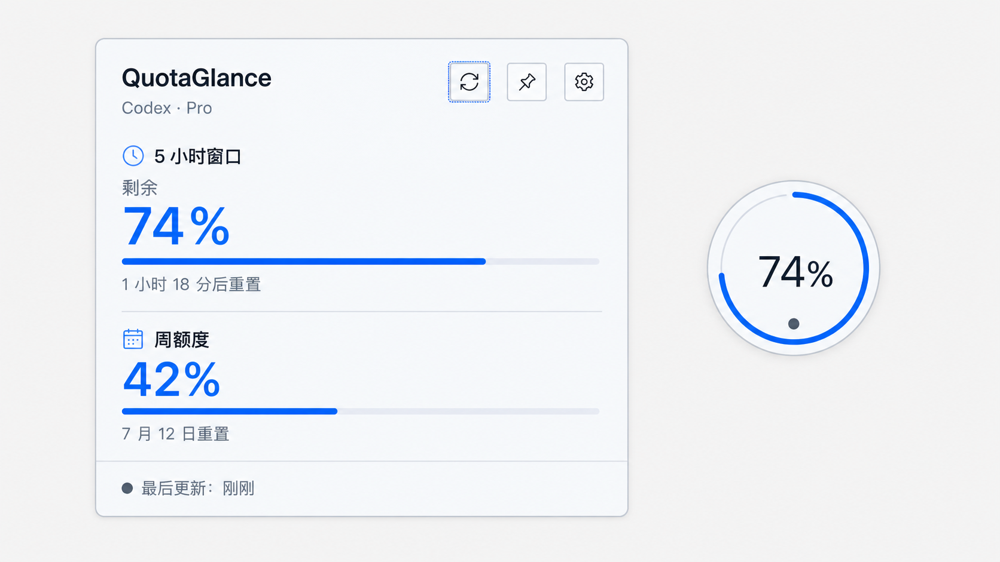

# QuotaGlance 首版界面设计基线

> 文档状态：M1 实施基线  
> 对应版本：`0.1.0`  
> 更新日期：2026-07-13  
> 维护邮箱：maorongkang@gmail.com

## 1. 概念图

首版视觉基线使用以下完整主界面概念：



概念图用于确定色彩、排版、组件几何和交互方向。2026-07-13 起，额度信息层级按最新需求收敛为单一周额度；概念图中的短周期读数不再作为当前实现要求。实际界面文字、按钮、进度条和图标必须使用 React、HTML、CSS 与 SVG 实现，不把概念图作为应用背景截图。

参考项目 Quota Float 只用于确认“展开卡片 + 浮球”的产品形态。QuotaGlance 不复制其品牌、布局、图标、渐变背景或私有额度接口。

## 2. 设计方向

- 视觉关键词：安静、准确、可信、轻量。
- 主界面是一块开放、扁平的额度读数面板，不堆叠卡片。
- 信息按“身份与操作 → 周额度 → 新鲜度”纵向排列。
- 健康状态以冷蓝色表达；提醒和危险状态只替换语义色，不改变整体布局。
- 浮球采用类似桌面加速球的完整球形轮廓，以多层玻璃高光、内侧暗部和圆形边缘形成三维体积；球内按“周额度 → 百分比 → 重置日期 → 状态”四层排版。进度环与动态水面共同表达周额度，水面使用低幅惯性倾斜、水平位移和回弹，高水位时横穿数字基线下方。
- 默认极光主题使用冰蓝玻璃和均匀冷光边沿；石墨主题使用深海军蓝表面与左上青色霓虹热点；纸白主题使用白玻璃、深色数字以及底部薄荷/蓝紫边缘光；日落珊瑚、蜂蜜琥珀、玫瑰铜夜提供由浅暖到深暖的三种渐变材质。

## 3. 允许的首屏文案

展开卡片首屏只使用以下可见文案：

```text
QuotaGlance
Codex · Pro
周额度
96%
7 月 20 日重置
最后更新：刚刚
```

百分比、套餐、重置时间和更新时间均来自领域快照或格式化函数，不能硬编码在组件中。上面的 `96%` 与 `7 月 20 日重置` 是浏览器视觉验收数据；`周额度` 是当前展示口径，组件只接收领域快照中 `kind=weekly` 的窗口。

设置、错误和空状态可以增加完成操作所需的文案，但不得挤入正常首屏或伪装成真实账号数据。

## 4. 设计令牌

| 令牌 | 浅色值 | 用途 |
|---|---|---|
| `--color-canvas` | `#f7f9fc` | 浏览器预览画布 |
| `--color-surface` | `#f7faff` | 卡片与浮球表面 |
| `--color-surface-strong` | `#ffffff` | 控件表面 |
| `--color-text` | `#111827` | 主文本 |
| `--color-text-muted` | `#607086` | 辅助文本 |
| `--color-border` | `#cbd6e4` | 1 像素边框 |
| `--color-track` | `#e5ebf3` | 进度轨道 |
| `--color-accent` | `#1769f7` | 健康状态和焦点 |
| `--color-warning` | `#d97706` | 提醒状态 |
| `--color-danger` | `#dc2626` | 危险和触顶状态 |
| `--color-neutral` | `#64748b` | 旧数据、未知和离线 |
| `--shadow-widget` | `0 18px 50px rgb(28 48 78 / 12%)` | 桌面悬浮层次 |

七套主题共用同一套语义令牌；卡片发光边框使用 `--card-edge-hotspot` / `--card-edge-glow`，主数字和进度分别使用 `--metric-color` / `--progress-color`，球壳、水体、水线和气泡使用独立 `--orb-*` 令牌。暖色主题额外定义 `--color-on-accent`，保证选中勾选和主按钮在强调色上的对比度不低于 4.5:1。

## 5. 排版

- 字体：`Inter`、`Segoe UI Variable`、`PingFang SC`、`Microsoft YaHei`、系统无衬线回退。
- 百分比使用 tabular numerals，避免刷新时数字左右跳动。
- 套餐标题：14px / 700 / 1.3，并使用适度字间距。
- 窗口标题：13px / 600 / 1.35。
- 周额度百分比：64px / 520 / 0.86。
- 元信息：11px / 500 / 1.4。
- 控件文字与辅助提示不得依赖浏览器默认字号。

## 6. 组件与尺寸

| 组件 | 目标尺寸 | 说明 |
|---|---:|---|
| `QuotaCard` | 320 × 320px | 默认展开状态；内容增加时允许最大高度 380px |
| `QuotaOrb` | 136 × 136px 窗口，128 × 128px 可见球体 | 正圆玻璃浮球，显示标题、百分比、重置日期、状态、动态水面和进度环 |
| `IconButton` | 30 × 30px | 统一图标、焦点、悬停和按下状态 |
| `ThemeControl` | 八轨网格，视觉呈现 4+3 两行 | 在设置面板内切换七套主题；使用真实色样、文字、选中边框和勾选图标共同表达状态，第二行三项居中 |
| 周额度进度条 | 5px 高 | 圆角只用于轨道端点 |
| 分隔线 | 1px | 只分隔额度内容和底部状态，不包裹新卡片 |

卡片圆角为 36px，发光主要通过遮罩边框和内阴影在 320px 原生窗口内绘制，避免外部阴影被 WebView 裁切。浮球使用 `border-radius: 50%`，在 136px 透明窗口中绘制 128px 正圆；球面由左上高光、中心蓝色和右下暗部组成，外沿使用多层亮色描边与 4px 以内柔光形成玻璃球壳。

## 7. 图标清单

首版使用同一套 1.75px 线性 SVG：

| 图标 | 含义 | 状态 |
|---|---|---|
| 刷新 | 手动读取额度 | 默认、刷新中、冷却、禁用 |
| 图钉 | 置顶 | 未选中、已选中 |
| 设置 | 打开设置 | 默认、展开 |
| 日历 | 周或长窗口 | 静态 |
| 状态点 | 数据新鲜度 | 正常、旧数据、离线、错误 |

图标使用 `currentColor`，保持一致的 `viewBox`、端点和光学尺寸，不使用文本字符代替。

## 8. 交互

- 双击或按 Enter/Space 可在卡片与浮球之间切换。
- 浮球右键弹出原生菜单，菜单严格只有“设置”和“退出”：设置会展开卡片并打开设置面板，退出会结束应用和 App Server 子进程。
- 刷新、置顶、解除鼠标穿透等恢复动作只保留在系统托盘或展开卡片中，不进入浮球右键菜单。
- 手动刷新立即进入可见刷新状态，冷却期内不重复发起请求。
- 图钉按钮切换置顶，并使用 `aria-pressed` 表达状态。
- 设置按钮打开紧凑设置面板；面板包含显示模式、七主题、置顶和鼠标穿透，并沿用相同令牌和排版。
- 浮球、卡片和设置面板都必须支持键盘操作和清晰焦点环。
- 动画只用于展开、收起、进度更新、刷新旋转和浮球水面，并遵守 `prefers-reduced-motion`。

浏览器预览可以切换 mock 状态；桌面构建必须通过 `src/api/` 调用 Tauri IPC，组件内不直接 `invoke`。

## 9. 状态变体

- `ok`：按周额度剩余比例使用健康、提醒或危险语义色；浮球水位与百分比同步。
- `loading`：保留布局，数字位置显示骨架，不伪造百分比。
- `stale`：保留最后成功值，进度使用中性色，底部显示最后成功时间。
- `signedOut`、`apiKeyMode`、`appServerMissing`、`incompatible`：主读数区域替换为明确说明和单一下一步，不显示 `0%`。
- 状态差异必须同时使用文字、图标或形态，不能只依赖颜色。

## 10. 响应与窗口

- 桌面 Tauri 卡片窗口以 320px 内容宽度为基线。
- 浏览器预览在窄于 480px 时只显示一个当前模式，隐藏设计画布说明。
- 不为移动端重新发明导航或营销布局；移动视口只用于验证组件不会溢出。
- 卡片内容高度变化时由 Rust `WindowManager` 协调窗口尺寸，避免 WebView 内滚动主额度信息。
- Tauri 窗口中的 `html`、`body`、`#root` 和组件画布必须保持透明，只有卡片或浮球自身绘制背景；卡片使用 `overflow: clip` 保持完整圆角，同时避免聚焦控件触发内部滚动。

## 11. 首版实现验收

- 卡片与浮球和本概念的层级、色彩、几何、排版一致。
- 正常、提醒、危险、旧数据和加载状态至少各有一个前端测试。
- 刷新、置顶、设置、展开/收起均有真实本地状态反馈。
- 320px 卡片和 136px 浮球无裁切、意外换行或浏览器默认控件样式。
- 125%、150% 和 200% 系统缩放下仍可读。
- 浏览器截图与概念图通过并排检查，差异记录在实现验收中。

## 12. 0.1.0 实现验收记录

2026-07-12 已使用浏览器开发预览对概念图与正式 React 组件做并排检查。该记录只证明界面组件在当前 Windows 开发机的浏览器环境中符合首版基线，不替代 Windows WebView2、macOS WKWebView、多屏或系统缩放实测。

| 对照项 | 实现结果 | 结论 |
|---|---|---|
| 信息层级 | 使用“身份与操作 → 周额度 → 新鲜度”，短周期、月度和未知窗口不进入卡片与浮球 | 通过 |
| 组件几何 | 卡片实测 `320 × 320px`；浮球窗口 `136 × 136px`，可见球体 `128 × 128px` 且圆角为 `50%` | 通过 |
| 排版 | 卡片周额度主读数 64px；浮球四层信息均位于球壳内，数字使用等宽数字特性 | 通过 |
| 色彩与状态 | 正常、提醒、危险和旧数据使用独立语义色；错误状态不显示假 `0%` | 通过 |
| 桌面画布 | `1200 × 800` 下无横纵向溢出，卡片内容无滚动 | 通过 |
| 窄视口 | `400 × 720` 下卡片居中，无横纵向溢出 | 通过 |
| 键盘操作 | 卡片与浮球支持 Enter/Space；设置支持 Escape 关闭并归还焦点 | 通过 |
| 运行状态 | 状态切换、置顶反馈、卡片/浮球切换和动态水面均有可见结果，控制台无警告或错误 | 通过 |
| 主题设置 | 七套主题均可选择；极光、石墨、纸白的卡片发光边框与球壳/水体联动，设置面板无内部溢出 | 通过 |
| 浮球右键菜单 | 右键可打开两项菜单，仅包含“设置”和“退出”；设置可展开卡片并打开设置面板 | 通过 |

### 12.1 与概念图的差异

- 概念图仍保留早期短周期读数用于追溯视觉来源；当前实现只显示周额度，属于需求变更后的预期差异。
- 概念图中的 `7 月 12 日重置` 是静态构图文案；实现使用 mock 或真实快照的动态时间，本次验收显示为其他日期，属于预期差异。
- 概念图用于放大说明组件结构；实现使用 320px 卡片和 136px 浮球窗口，球体与卡片的比例约为 40%，接近本轮参考稿。
- 实现增加了仅开发环境可用的状态切换栏，用于检查正常、提醒、危险、旧数据、加载和错误；该工作台已从生产构建中移除。
- 实现的状态点跟随数据新鲜度使用语义色，而概念图只展示单一静态状态点。
- 设置面板属于需求中的必要下游状态；实现沿用相同令牌，并覆盖七主题、置顶与鼠标穿透反馈。

### 12.2 尚待验收

- Windows 11 WebView2 中的透明窗口、阴影、DPI 和多屏边界；
- macOS Intel 与 Apple Silicon 的字体、透明窗口和菜单栏表现；
- 125%、150% 和 200% 系统缩放；
- 七套主题的目标平台 WebView/WKWebView 视觉回归；
- 多额度桶同时返回多个周额度时的用户选择界面。
